# Terran Republic Interstellar Plotter System
## Introduction

TRIPS (Terran Interstellar Plotter System) is intended to be a stellar cartography system for loading stellar databases in well-known formats to:
1. view data in tabular form
2. Plot data in a 3 dimensional graph
3. Modify stellar data 
4. Keep data organized in different sets based on purpose and interest
5. Use for either scientific or science fiction writing purposes (world building)

## Contributing

1. Fork it!
2. Create your feature branch: `git checkout -b my-new-feature`
3. Commit your changes: `git commit -am 'Add some feature'`
4. Push to the branch: `git push origin my-new-feature`
5. Submit a pull request

Please read the [CONTRIBUTING.md](CONTRIBUTING.md) file for more details on how
to contribute to this project.

## Versioning

This project uses [SemVer](http://semver.org/) for versioning. For the versions
available, see the [tags on this repository](https://github.com/ljramones/trips/tags).

## Gitflow
This project is setup to work as a gitflow project. Please read [this guide on how gitflow works](https://nvie.com/posts/a-successful-git-branching-model/).

If you need a tool to make using gitflow easy to use, [check this one out as I use it](https://danielkummer.github.io/git-flow-cheatsheet/).

## Installing
    a. Down load one of the release versions from the release page.
    b. unzip into a target direction of your choice
    c. acquire data files from one of the data pages (TBD) and unzip into the ./files directory

## Building
This project is configured as a spring boot application with a single jar to run.
The tripsapplication subpackage holds all the code need to generate a trip-_version_.jar, where _version_ is the releaseable version.

To build, simply run `mvn package`, which will put a compiled jar in the target subdirectory.
To run simply form the command line, `java -jar target/trips-version.jar`

## Running
    a. Once installed, the install directory is complete and independent. Nothing else needs to be installed
    b. in the main director, run either
        - runme.bat (Windows version)
        - runme.sh (Mac/Linux version)        
  
## Using Application
You will see a screen as below:

Main Screen: 
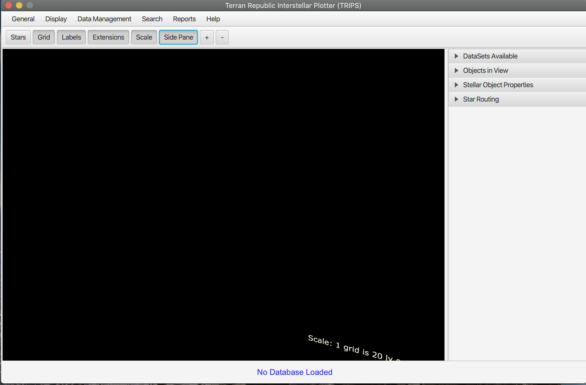

### Loading a Data set into the Database

Select the Data Manager
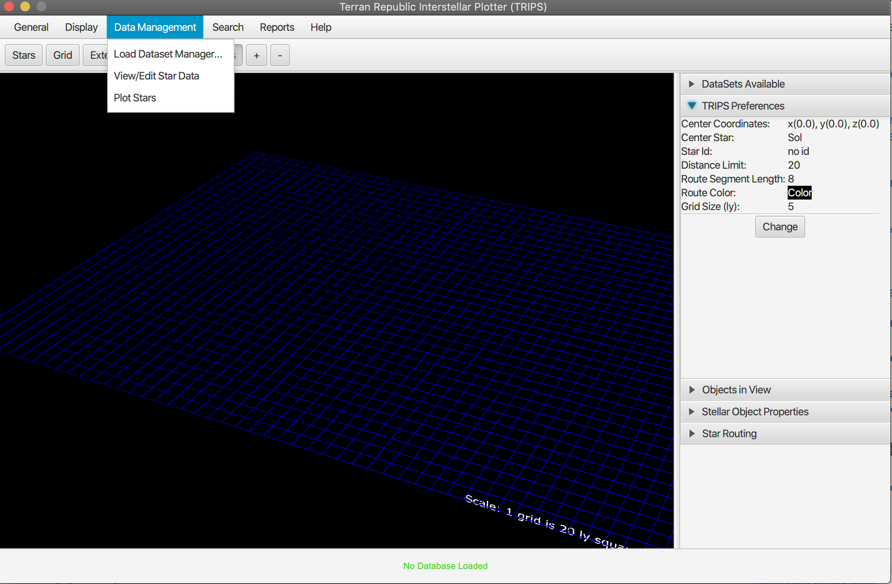

The Data Manager
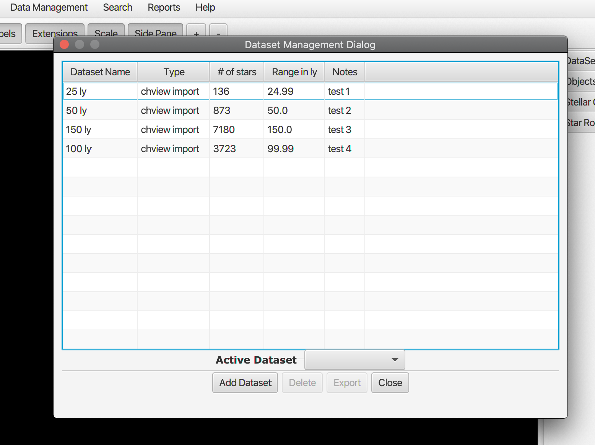

Add A Dataset

Fill out description, select format and chose file
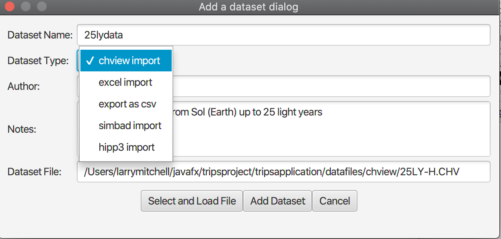

Select File

Dataset in Data Manager
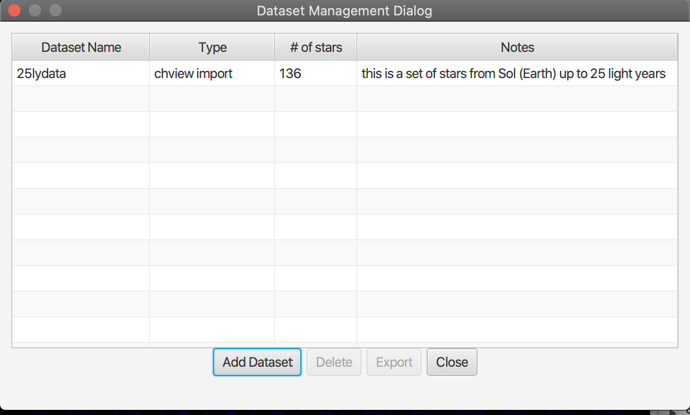

Dataset in side panel
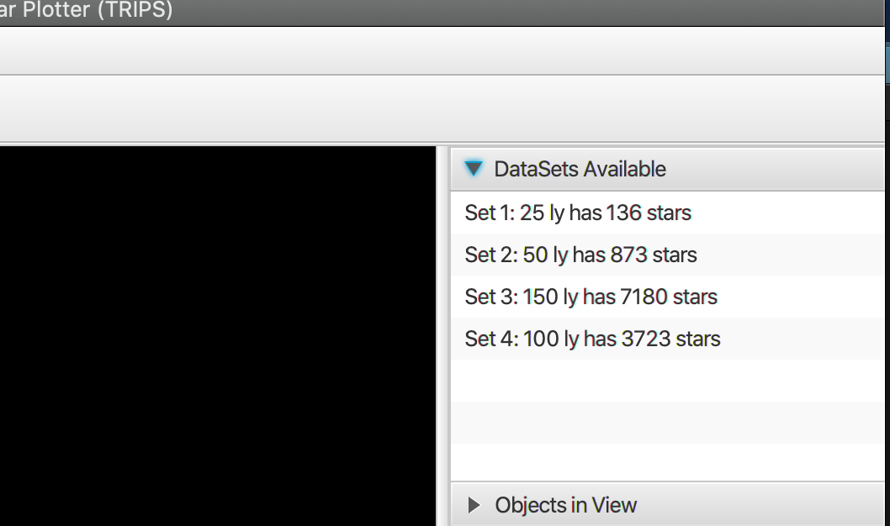

###Plotting and Displaying data

Plotting menu
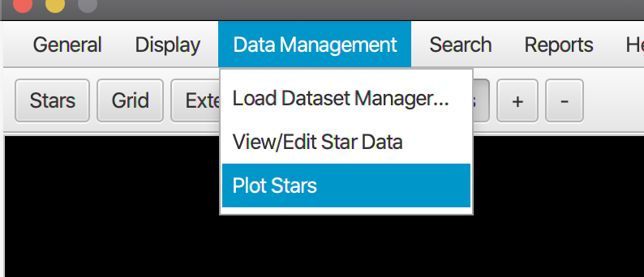

Select a dataset to plot
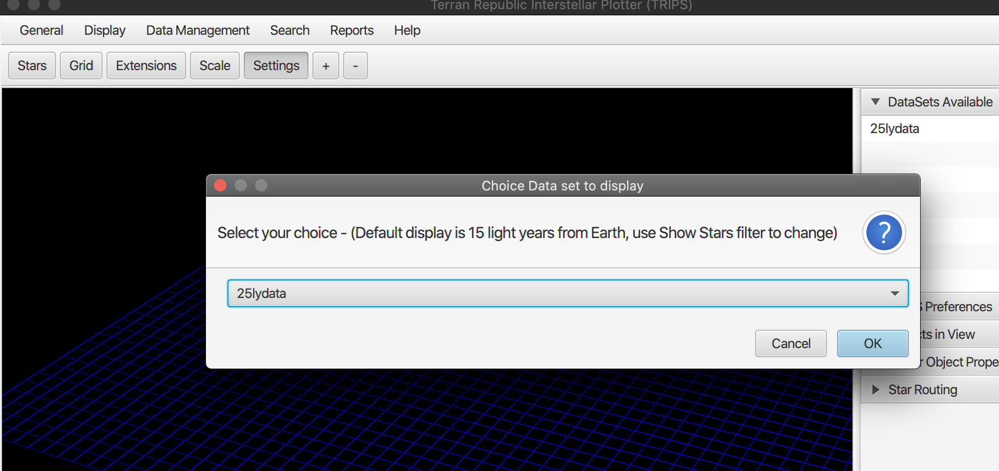

Notification of plot
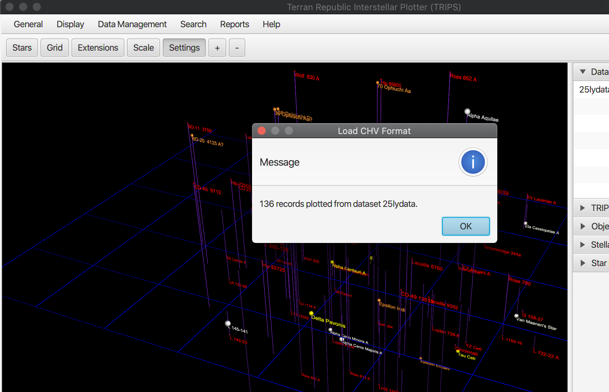

Zooming in and out on a plot
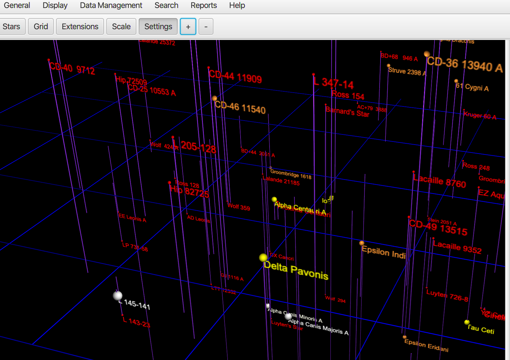

Mouse selection of a star
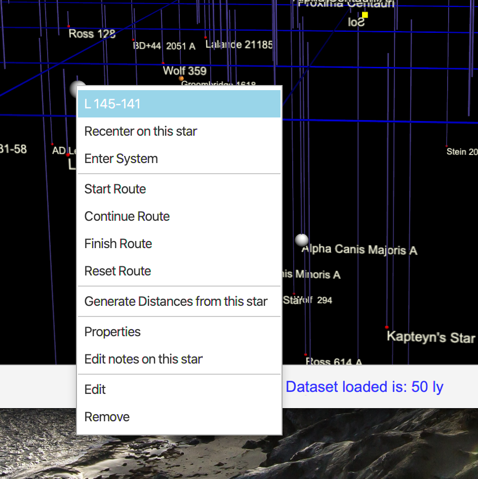

Stellar Properties

###Querying Stars
Generating a Query on a data set
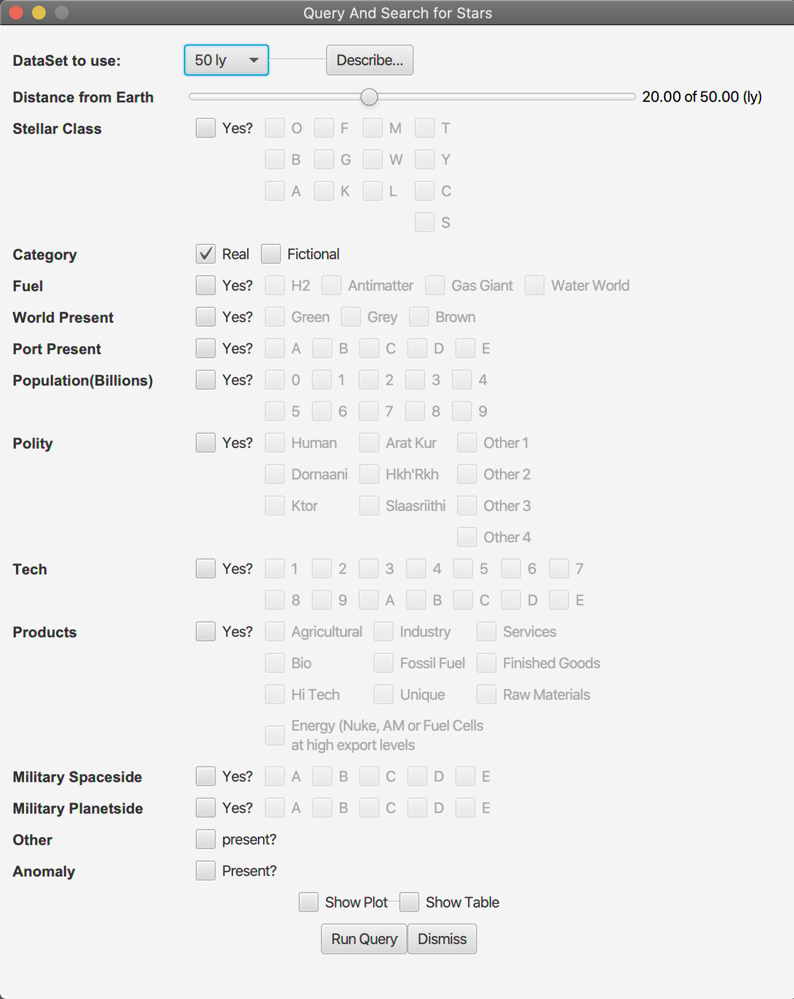

Dataset Description

Composite Data View
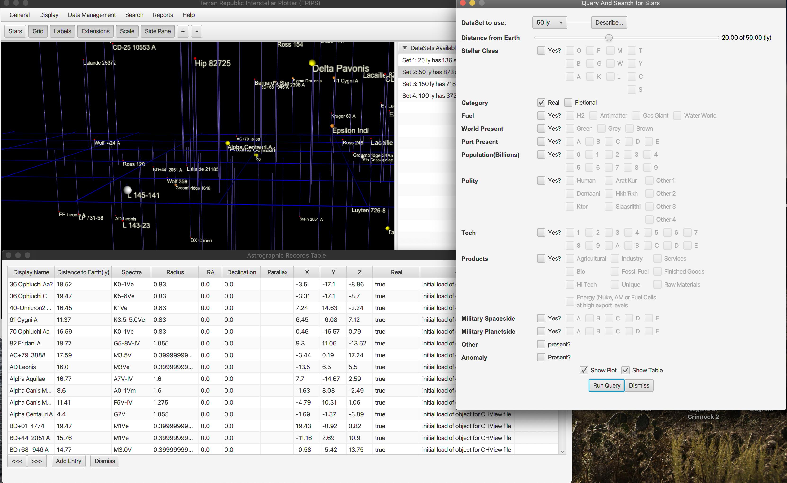

View/Edit table data

Edit of Delete of data rows
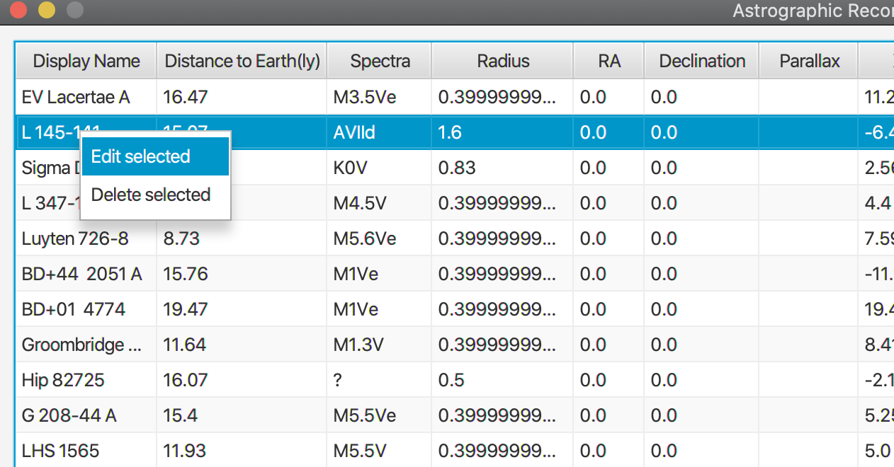

Update Stellar Object

