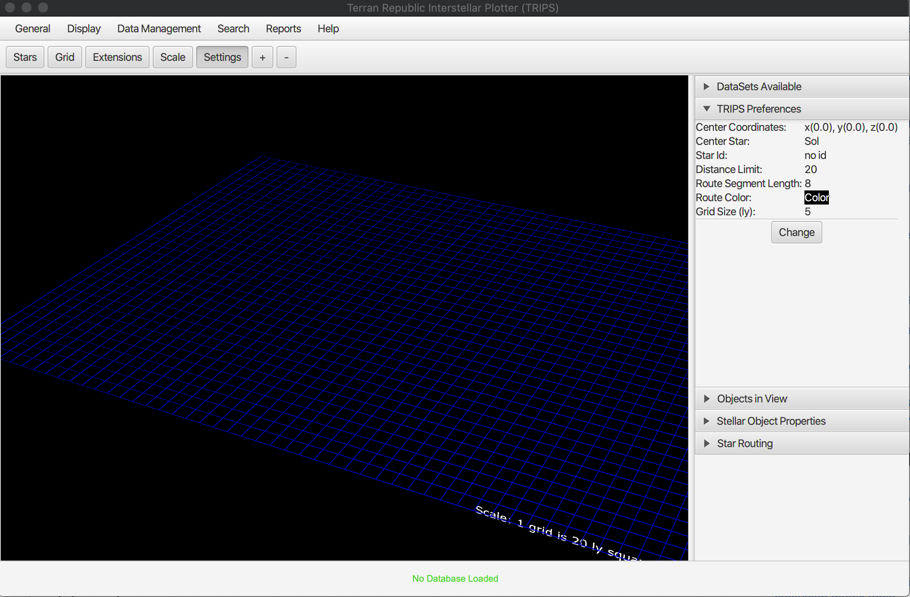
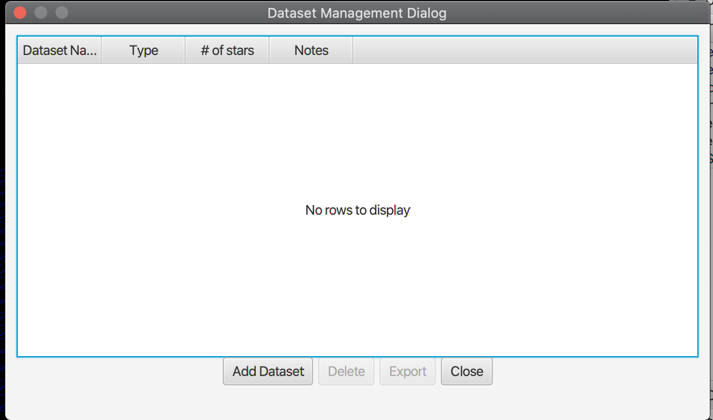
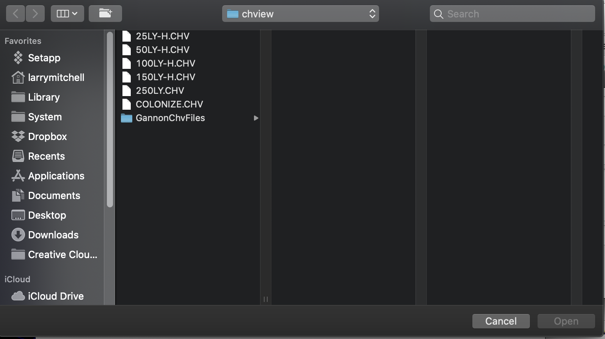
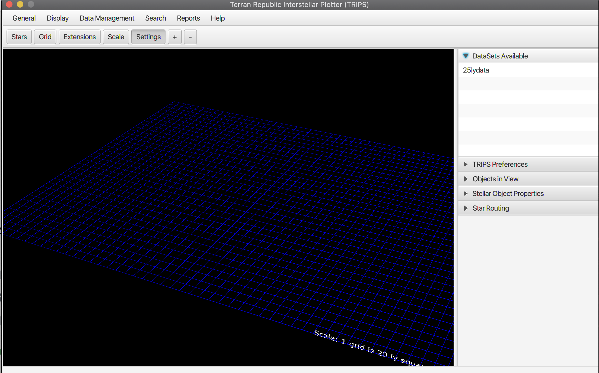
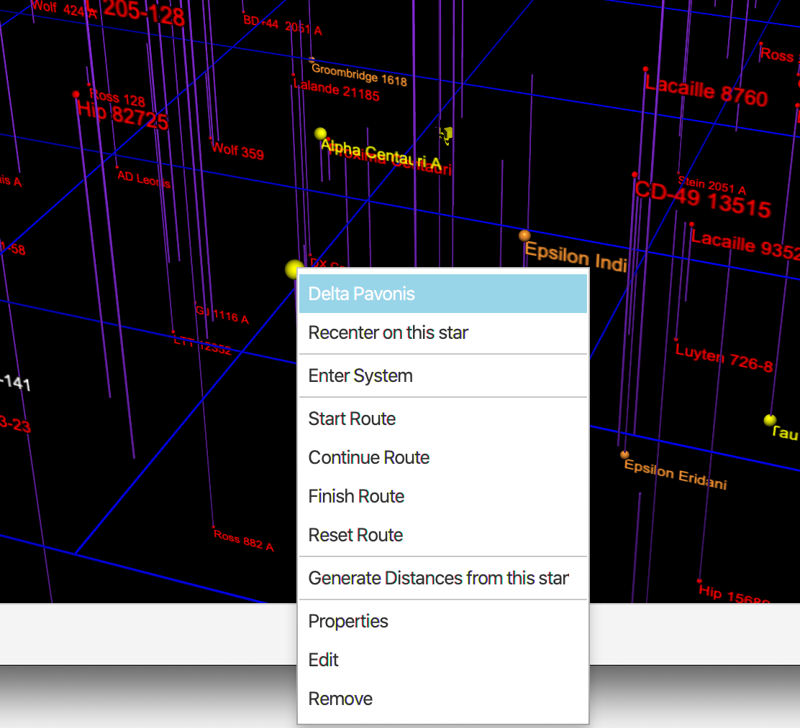
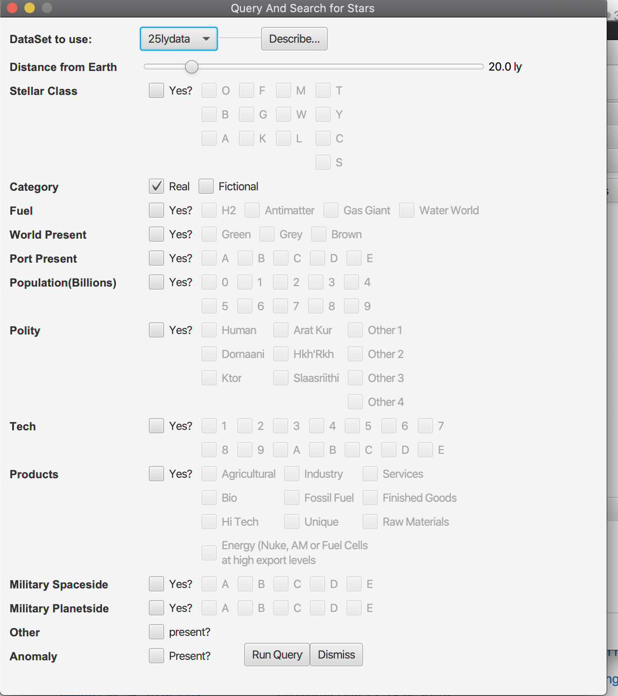

# Terran Republic Interstellar Plotter System
## Introduction

TRIPS (Terran Interstellar Plotter System) is intended to be a stellar cartography system for loading stellar databases in well-known formats to:
1. view data in tabular form
2. Plot data in a 3 dimensional graph
3. Modify stellar data 
4. Keep data organized in different sets based on purpose and interest
5. Use for either scientific or science fiction writing purposes (world building)

## Installing
    a. Down load one of the release versions form the release page.
    b. unzip into a target direction of your choice
    c. acquire data files from one of the data pages (TBD) and unzip into the ./files directory

## Running
    a. Once installed, the install directory is complete and independent. Nothing else needs to be installed
    b. in the main director, run either
        - runme.bat (Windows version)
        - runme.sh (Mac/Linux version)
        
        
##Using Application
You will see a screen as below:

Main Screen: 

### Loading a Data set into the Database

Select the Data Manager

The Data Manager

Add A Dataset

Fill out description, select format and chose file

Select File

Dataset in Data Manager

Dataset in side panel

###Plotting and Displaying data

Plotting menu

Select a dataset to plot

Notification of plot

Zooming in and out on a plot

Mouse selection of a star

Stellar Properties

###Querying Stars
Generating a Query on a data set

Dataset Description

Composite Data View

View/Edit table data

Edit of Delete of data rows

Update Stellar Object

