# Terran Republic Interstellar Plotter System
## Introduction

TRIPS (Terran Interstellar Plotter System) is intended to be a stellar cartography system for loading stellar databases in well-known formats to:
1. view data in tabular form
2. Plot data in a 3 dimensional graph
3. Modify stellar data 
4. Keep data organized in different sets based on purpose and interest
5. Use for either scientific or science fiction writing purposes (world building)

## Contributing

1. Fork it!
2. Create your feature branch: `git checkout -b my-new-feature`
3. Commit your changes: `git commit -am 'Add some feature'`
4. Push to the branch: `git push origin my-new-feature`
5. Submit a pull request

Please read the [CONTRIBUTING.md](CONTRIBUTING.md) file for more details on how
to contribute to this project.

## Versioning

This project uses [SemVer](http://semver.org/) for versioning. For the versions
available, see the [tags on this repository](https://github.com/ljramones/trips/tags).

## Gitflow
This project is setup to work as a gitflow project. Please read [this guide on how gitflow works](https://nvie.com/posts/a-successful-git-branching-model/).

If you need a tool to make using gitflow easy to use, [check this one out as I use it](https://danielkummer.github.io/git-flow-cheatsheet/).

## Installing
    a. Down load one of the release versions from the release page.
    b. unzip into a target direction of your choice
    c. acquire data files from one of the data pages (TBD) and unzip into the ./files directory

## Building
This project is configured as a spring boot application with a single jar to run.
The tripsapplication subpackage holds all the code need to generate a trip-_version_.jar, where _version_ is the releaseable version.

To build, simply run `mvn package`, which will put a compiled jar in the target subdirectory.
To run simply form the command line, `java -jar target/trips-version.jar`

## Running
    a. Once installed, the install directory is complete and independent. Nothing else needs to be installed
    b. in the main director, run either
        - runme.bat (Windows version)
        - runme.sh (Mac/Linux version)        
  
## Using Application
You will see a screen as below:

Main Screen: 

### Application Preferences
Most of the plot items can be toggled through this drop down menu or the tool baf

Selecting application preferences is a general non data specific screen
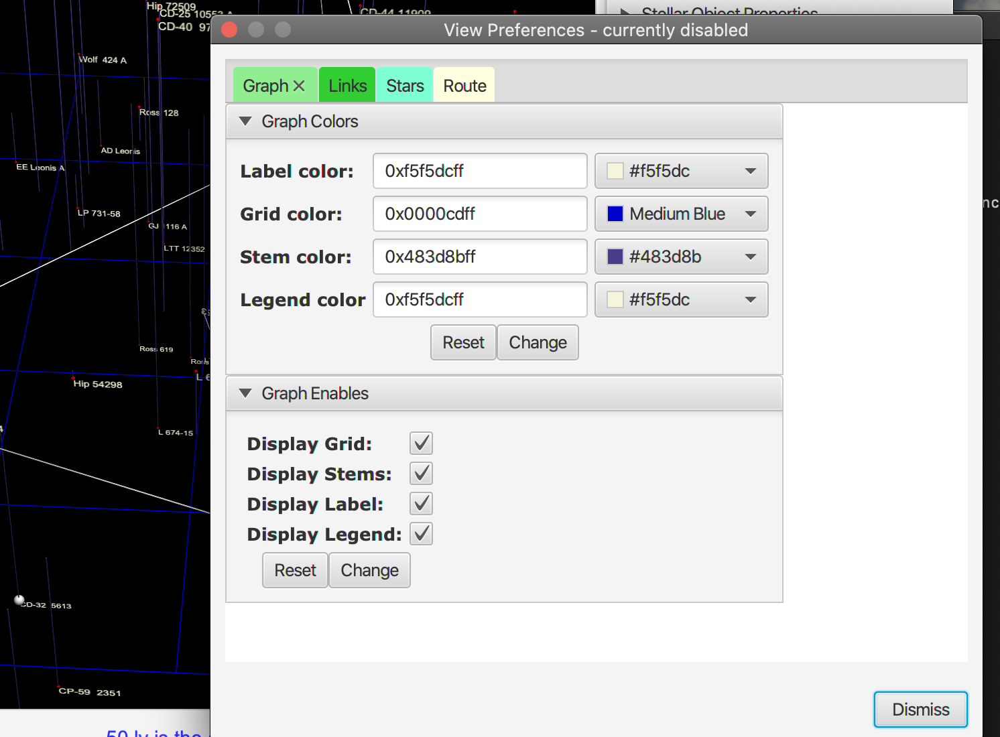

### Loading a Data set into the Database

Select the Data Manager

The Data Manager

Add A Dataset

Fill out description, select format and chose file

Select File

Dataset in Data Manager

Selecting a Data set context
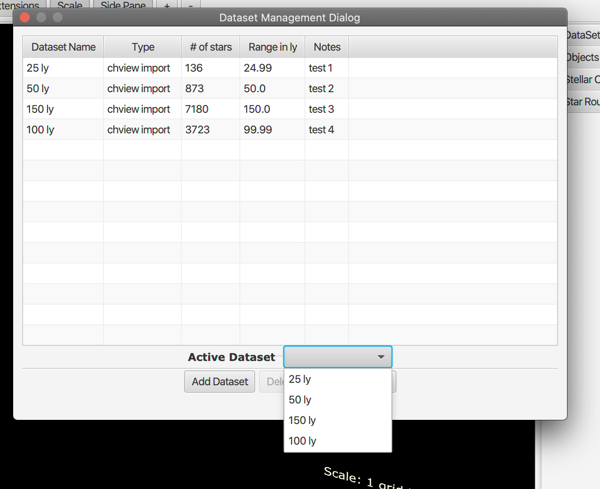

Dataset in side panel

Functions from Dataset side panel
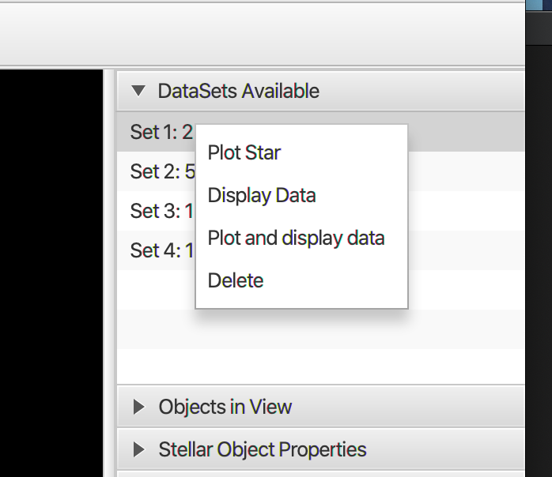

### Plotting and Displaying data

Plotting menu

If there was no dataset selected as current context then you will be asked for one

Notification of plot

Plot of data selected
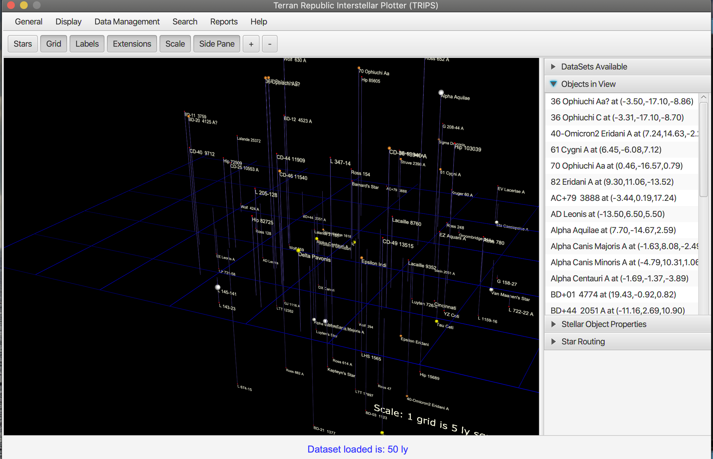

Zooming in and out on a plot

Mouse selection of a star

Stellar Properties
Selecting a star in the list view or form the menu above by selecting properties which show all the properties of that star
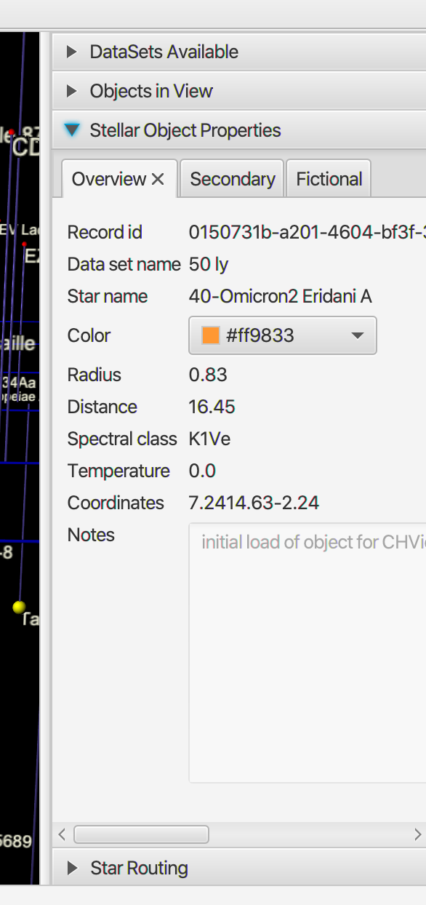

### Querying Stars
Generating a Query on a data set

Dataset Description

Composite Data View

View/Edit table data

Edit of Delete of data rows

Update Stellar Object

### General Plotting and Star Maintenance
Add Notes to a star on the plot
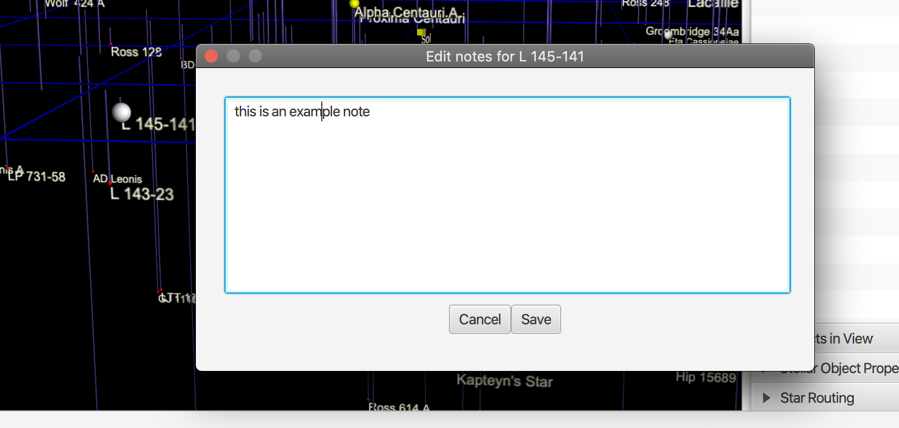

Edit a Star Entry
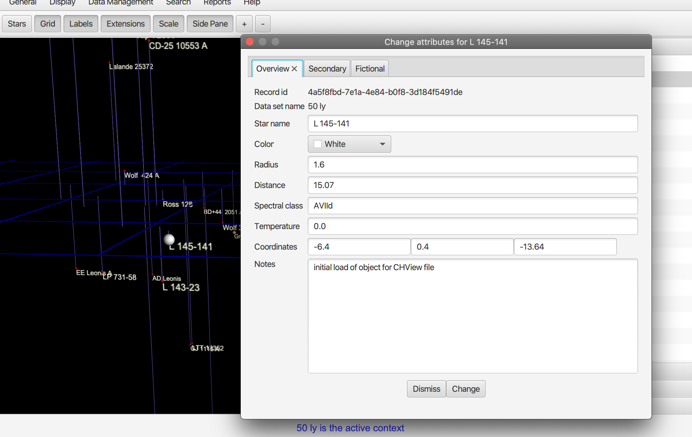

The Edit can be actioned from the side panel list view by bringing up a context menu
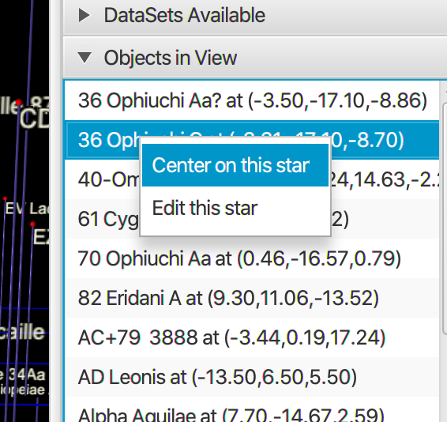

Selecting edit brings up the edit dialog above

Recentering on a star

Recenter selection
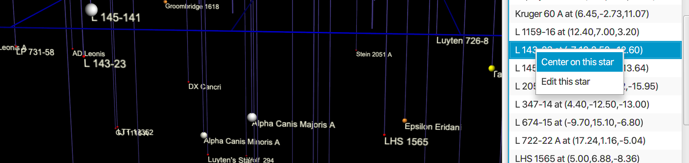

Recenter Result
Generally, this does a query on the stars with the same radius view as already selected. 
Often it means we may have less or more stars in the view.
The new center star will be enclosed in a box and slowly rotate to show that it is at the center of a new plot
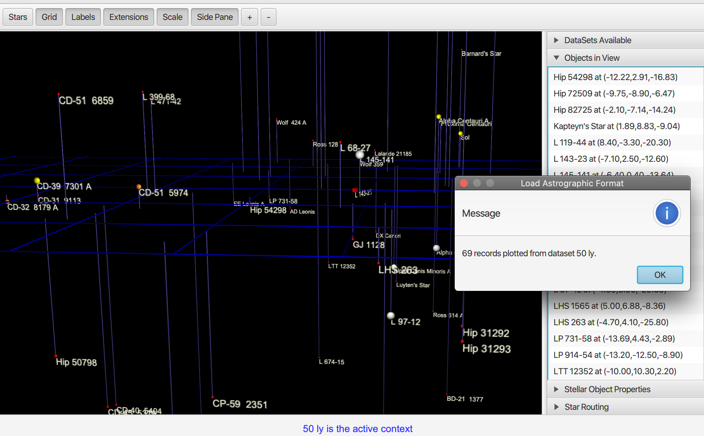

### Routes

In this  first iteration, we only support manually created routes, but in later versions, this will be done either
1) automatically
2) with heuristics

Starting a route
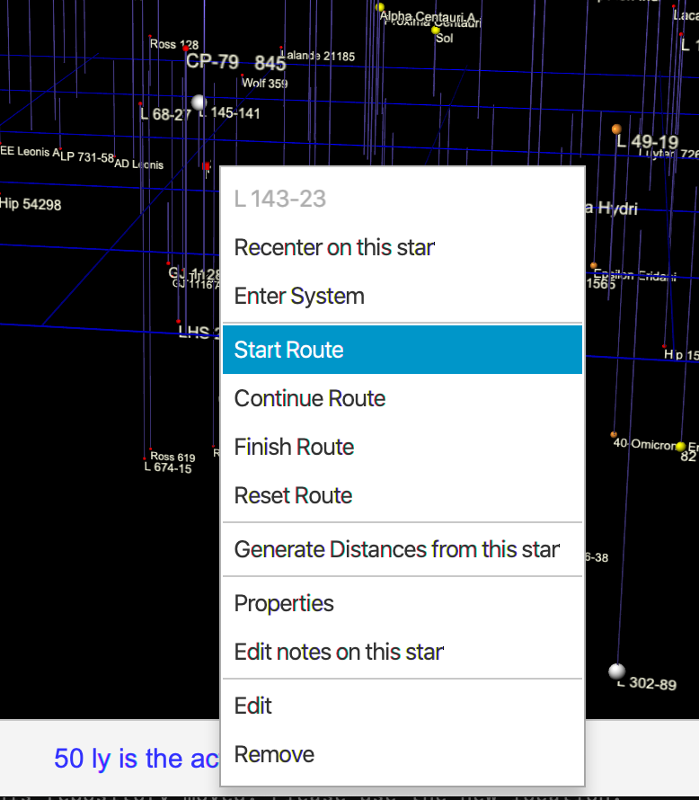

Identifying the route
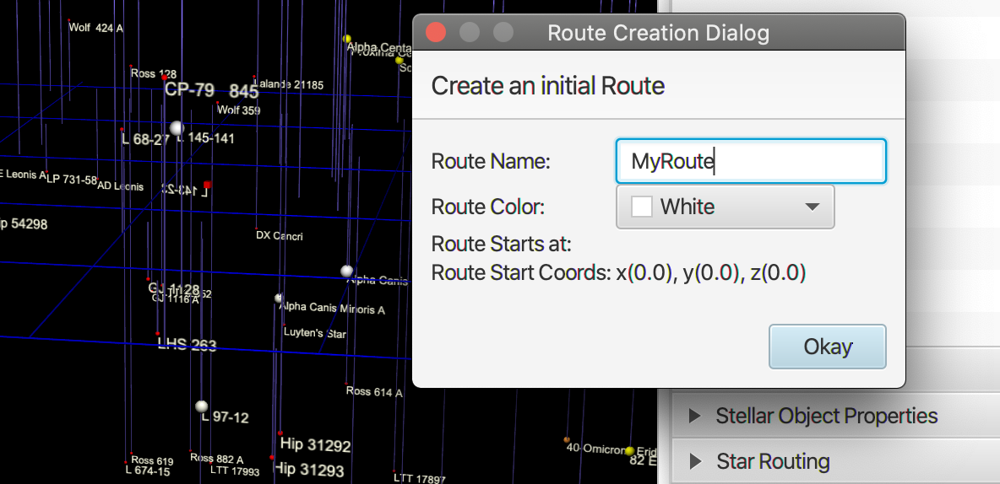

Selecting the next route segment
Connecting route segments is through the continue function
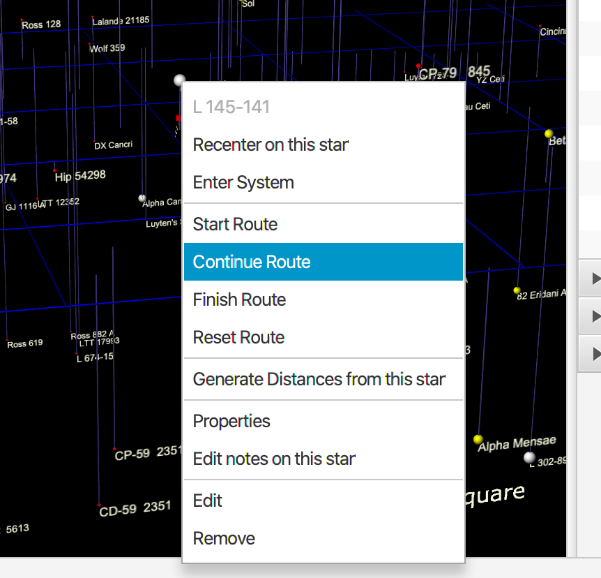

Finishing a route
After you have lonked multiple segments, you select finish, which saves the route to the database for that dataset
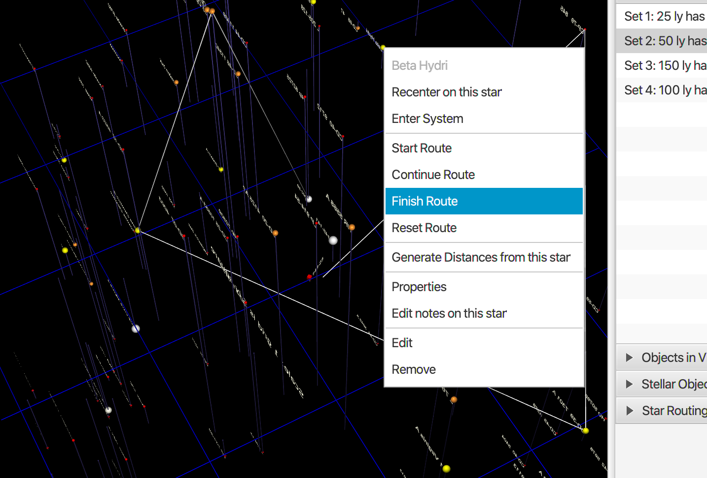

After which the complete route will be displayed in the 3D plot
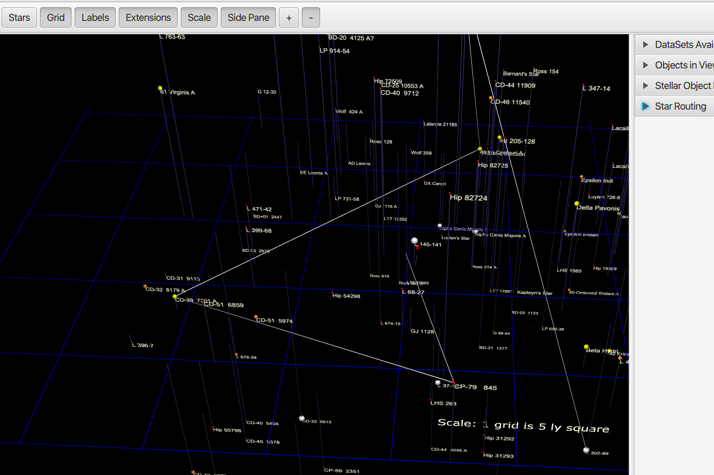

