# Datasets and Imports

TRIPS supports multiple datasets. You can import new data, switch between datasets, and configure which catalog is active for operations.

A sample dataset derived from Gaia DR2 data (`30ly.trips.csv`) is included with TRIPS. On first launch, you'll need to import this file (or your own data) before you can visualize stars.

## Importing a Dataset

To import a dataset, use **File → Import/Load or Manage dataset(s)** from the menu bar:

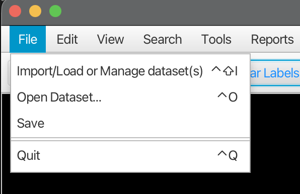

This opens the Dataset Management Dialog. On first launch, the table will be empty:

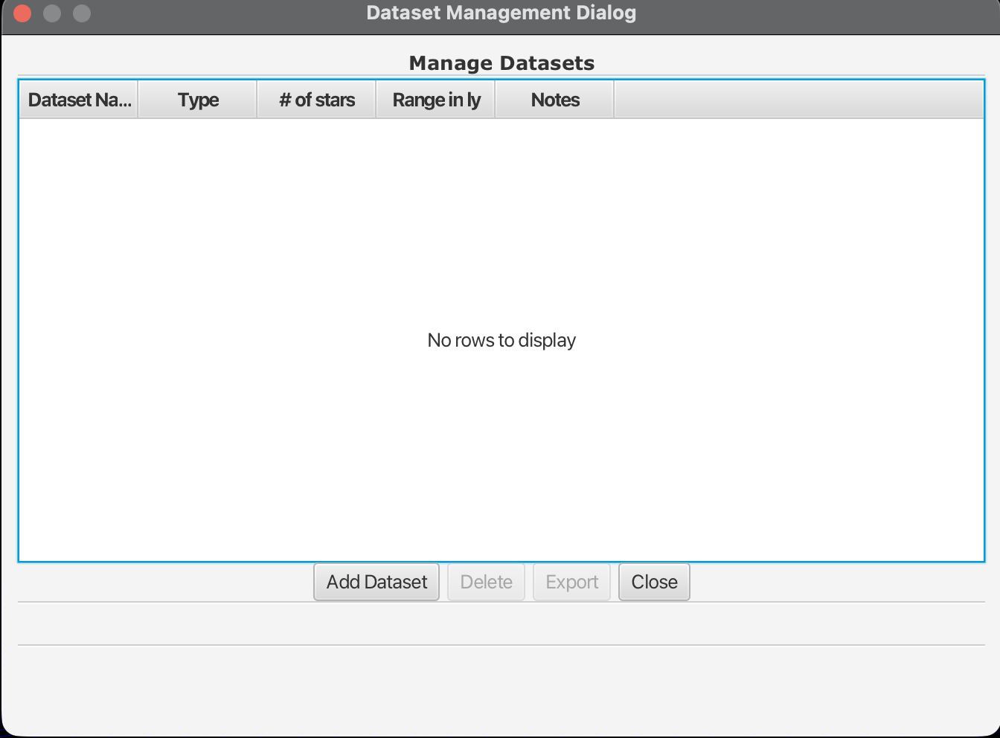

Once you have imported datasets, the table shows them with columns for:
- **Dataset Name**: The name you gave the dataset
- **Type**: The format/source of the data
- **# of stars**: How many stars are in the dataset
- **Range in ly**: The distance range covered (in light years)
- **Notes**: Any notes about the dataset

The buttons at the bottom allow you to:
- **Add Dataset**: Import a new dataset from a CSV file
- **Delete**: Remove the selected dataset
- **Export**: Export the selected dataset as CSV
- **Close**: Close the dialog

### Adding a Dataset

Click **Add Dataset** to open the import dialog:

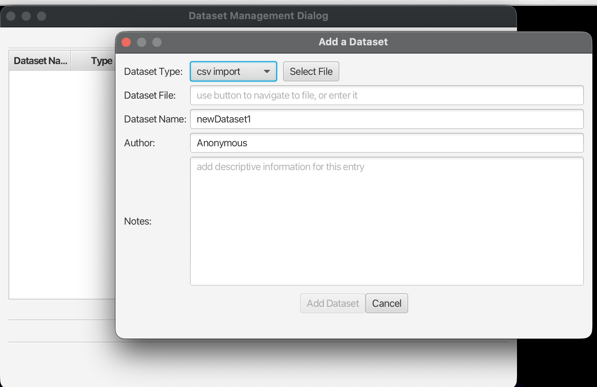

Fill in the following fields:

1. **Dataset Type**: Select the format (e.g., "csv import")
2. **Select File**: Click to browse for the data file:

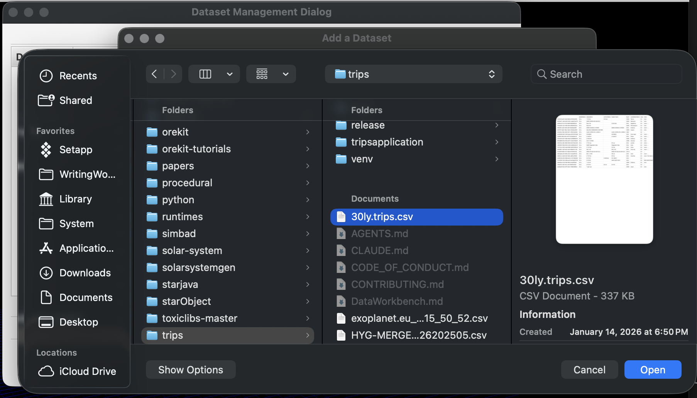

Navigate to your CSV file and click **Open**. The included sample dataset is named `30ly.trips.csv`.

3. **Dataset Name**: Give your dataset a meaningful name
4. **Author**: Optionally record who created/provided the data
5. **Notes**: Add any descriptive information about the dataset

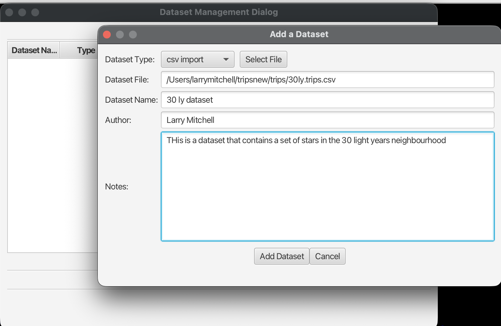

Click **Add Dataset** to import the data, or **Cancel** to close without importing.

When the import completes, you'll see a confirmation dialog:

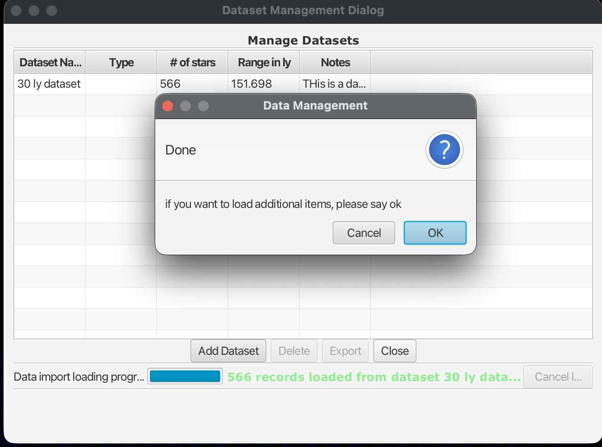

The progress bar at the bottom shows the import status (e.g., "566 records loaded from dataset 30 ly data..."). Click **OK** to import additional datasets, or **Cancel** to finish.

The dataset now appears in the management table:

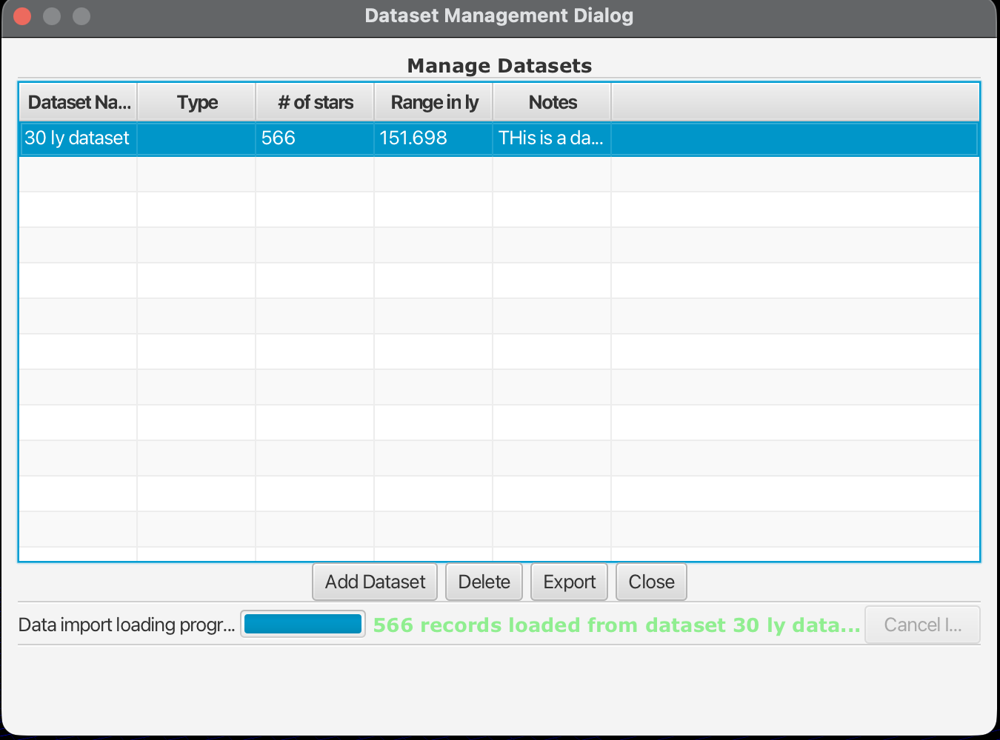

With a dataset selected, the **Delete** and **Export** buttons become active. Click **Close** to return to the main application.

### Deleting a Dataset

To remove a dataset, select it in the table and click **Delete**. A confirmation dialog appears:

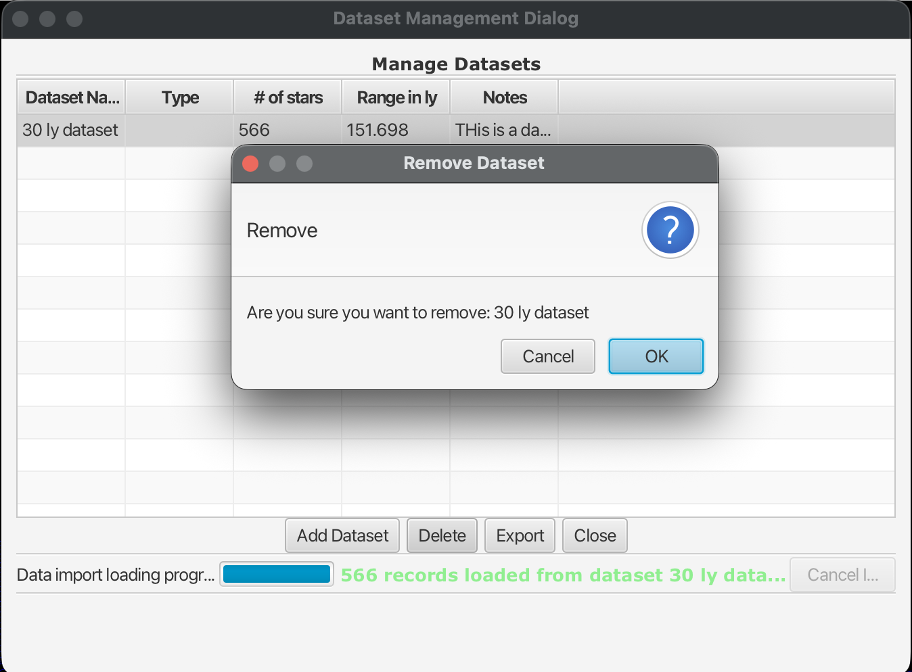

Click **OK** to permanently remove the dataset, or **Cancel** to keep it.

### Exporting a Dataset

To export a dataset as CSV, select it in the table and click **Export**:

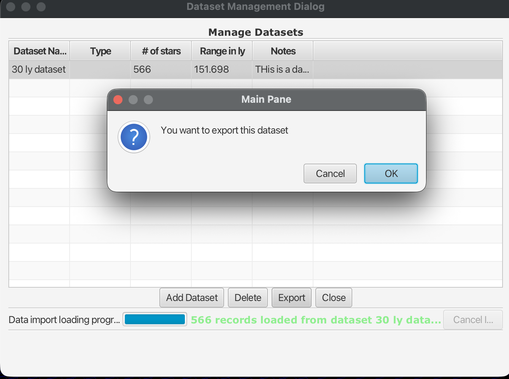

Click **OK** to proceed. You'll be prompted to choose a location and filename for the exported CSV file.

## Opening a Dataset (Setting the Context)

TRIPS operates on a single dataset at a time, called the **context**. The context determines which stars are available for searching, plotting, and routing operations.

To set the context, use **File → Open Dataset...** to select from your previously imported datasets:

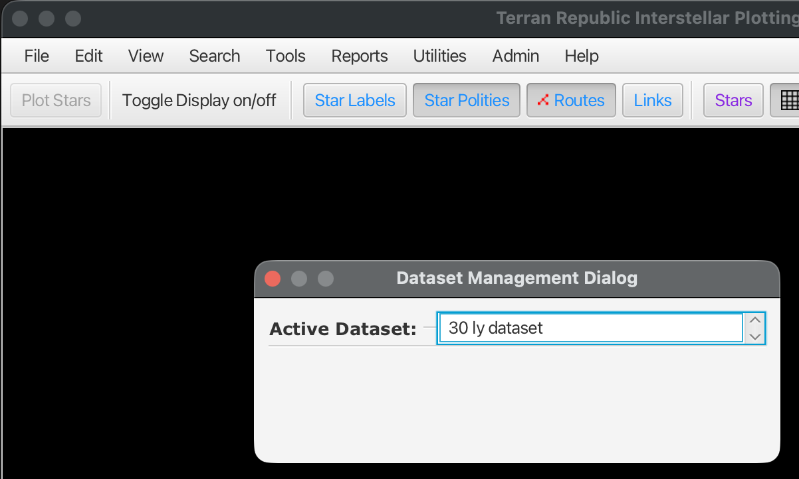

Use the **Active Dataset** dropdown to choose which dataset to work with. Once selected, all operations will work with that dataset until you switch to another.

### Using the Side Panel

You can also manage datasets using the **DataSets Available** section in the side panel:

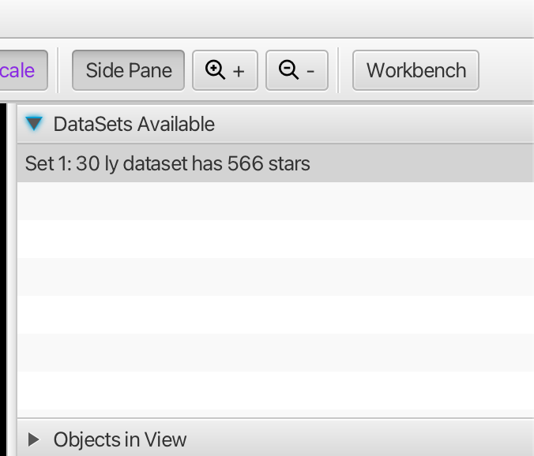

1. Open the side panel (click **Side Pane** in the toolbar)
2. Expand the **DataSets Available** section
3. Your imported datasets are listed with their star count (e.g., "Set 1: 30 ly dataset has 566 stars")

Right-click on a dataset to see the available actions:

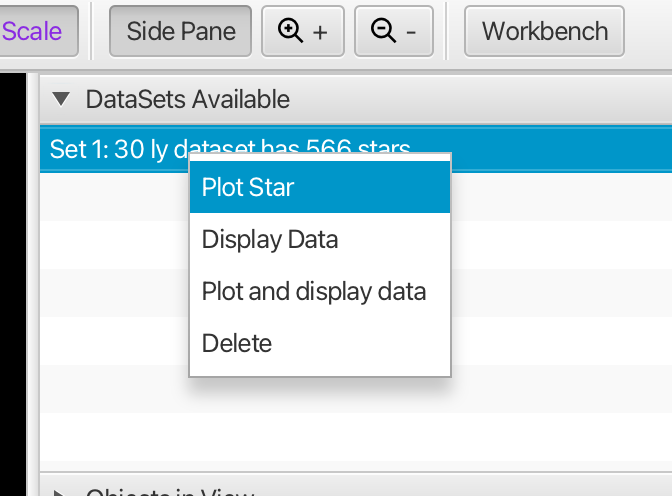

- **Plot Star**: Plot the stars from this dataset in the 3D view
- **Display Data**: Show the dataset information
- **Plot and display data**: Do both actions at once
- **Delete**: Remove the dataset

## Viewing Your Data

After selecting a dataset context and clicking **Plot Stars** in the toolbar (or restarting TRIPS), you'll see the stars plotted in the 3D Interstellar view:

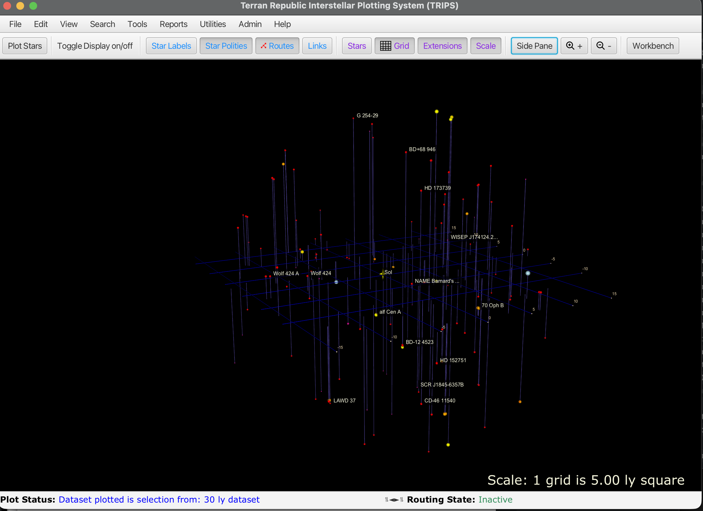

By default, TRIPS displays stars up to 20 light years from Sol. The status bar shows which dataset is plotted (e.g., "Dataset plotted is selection from: 30 ly dataset"). Stars are shown with vertical stems indicating their position above or below the reference grid, with labels for notable stars like Sol, Barnard's Star, Alpha Centauri, and others.

For more on navigating the 3D view, see [Interstellar View](interstellar-view.md).

## Data Workbench (Advanced)

The Data Workbench is a separate tool for advanced users. It is **not** for importing regular datasets. Instead, it provides:

- Querying online astronomical sources (Gaia, SIMBAD, VizieR)
- Enriching existing data with additional catalog information
- Advanced dataset management and transformation

Access the Data Workbench by clicking the **Workbench** button in the toolbar.

## Troubleshooting

- **No datasets appear**: Confirm you have imported at least one dataset via File → Import/Load or Manage dataset(s).
- **Import doesn't recognize file format**: Ensure the file is a properly formatted CSV with the expected columns.
- **Data Workbench queries fail**: Check your internet connection and that the astronomical services (Gaia, SIMBAD, VizieR) are available.
