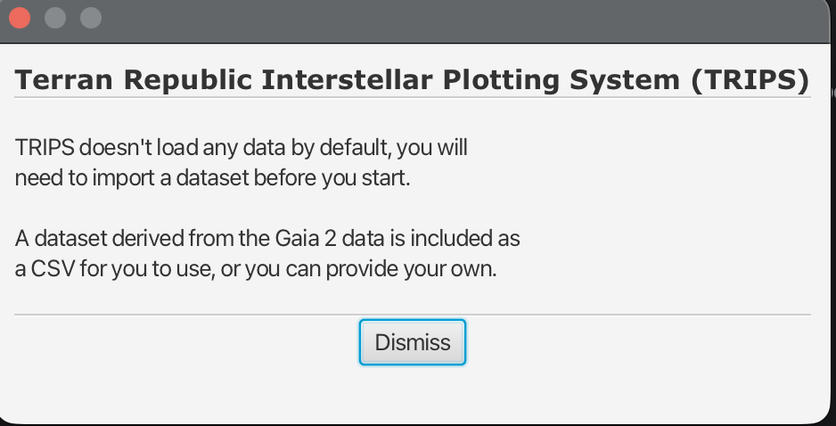
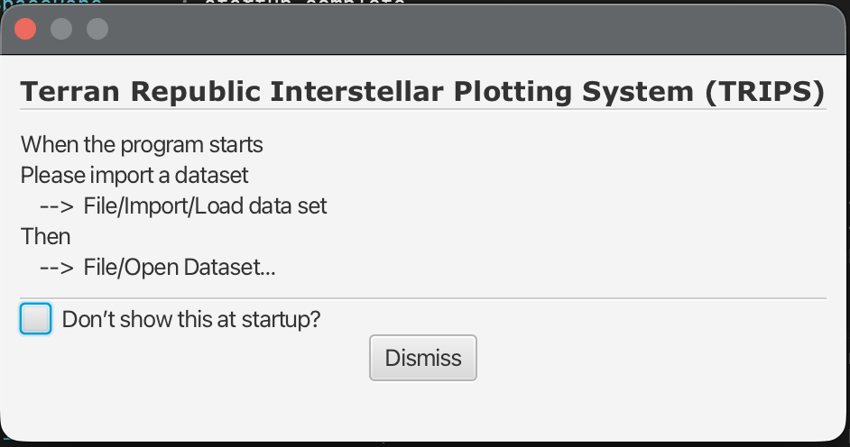
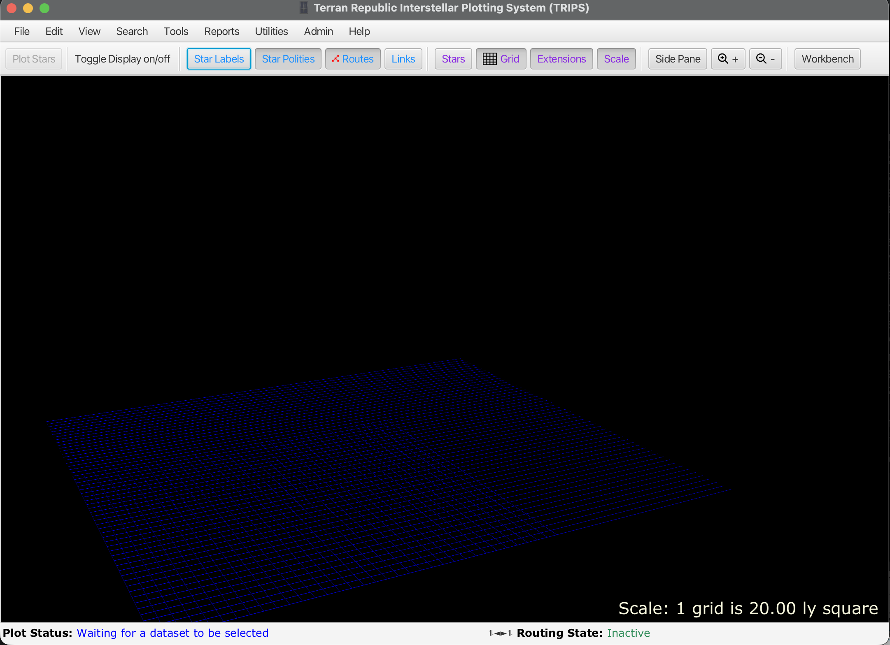
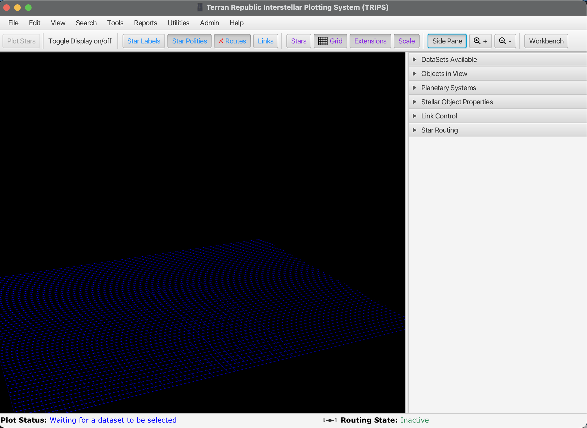

# Getting Started

This section covers installation, first launch, and setting up your initial dataset.

## Install and Run

- Follow the installation steps in [docs/INSTALLATION.md](../INSTALLATION.md).
- Launch the application using your platform-specific `runme` script as described in [docs/RUNNING.md](../RUNNING.md).

## First Launch

When you first start TRIPS, you'll see a welcome dialog explaining that no data is loaded by default:

Click **Dismiss** to continue. A second dialog provides instructions for getting started:

This dialog tells you to:
1. Import a dataset via **File → Import → Load data set**
2. Then open it via **File → Open Dataset...**

A dataset derived from Gaia DR2 data is included with TRIPS as a CSV file that you can import. You can also check the "Don't show this at startup?" box if you don't want to see these messages again.

## The Main Interface

After dismissing the startup dialogs, you'll see the main TRIPS window. This is called the Interstellar view. When a dataset is loaded, it will show a three-dimensional star field:

The interface shows:
- **Menu bar**: File, Edit, View, Search, Tools, Reports, Utilities, Admin, Help
- **Toolbar**: Quick access buttons for common functions (colored buttons toggle various display elements)
- **3D viewport**: The interstellar view with a reference grid (currently empty, waiting for data)
- **Status bar**: Shows "Waiting for a dataset to be selected" and routing state

Click the **Side Pane** button in the toolbar to reveal the control panel:

The side panel contains expandable sections:
- **DataSets Available**: Select and manage loaded datasets
- **Objects in View**: List of currently displayed stars
- **Planetary Systems**: Information about solar systems
- **Stellar Object Properties**: Details of the selected star
- **Link Control**: Manage transit connections between stars
- **Star Routing**: Plan and display routes

## First Launch Checklist

1. Confirm the app opens to the Interstellar view.
2. Verify you can see a star field and a right-side control pane.
3. Open the dataset selector and confirm at least one dataset is available.
4. If no datasets are available, see [Datasets and Imports](datasets-and-imports.md).

## Where to Go Next

- Learn how to load or import data: [Datasets and Imports](datasets-and-imports.md).
- Explore stars and system views: [Interstellar View](interstellar-view.md).
- Plan routes between stars: [Route Planning](route-planning.md).
