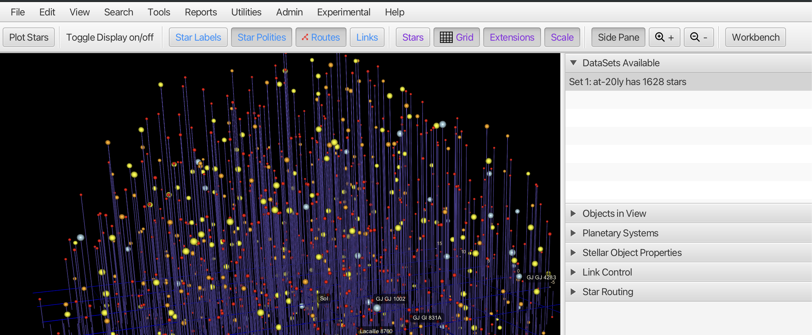
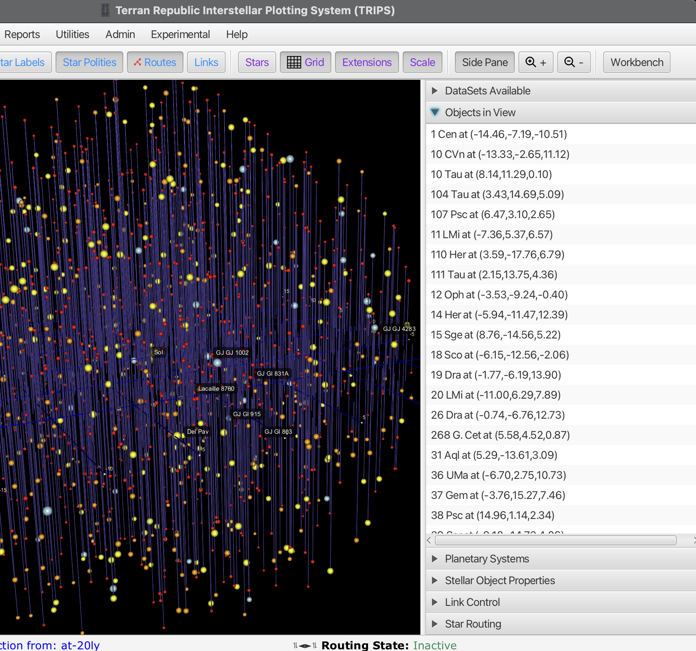
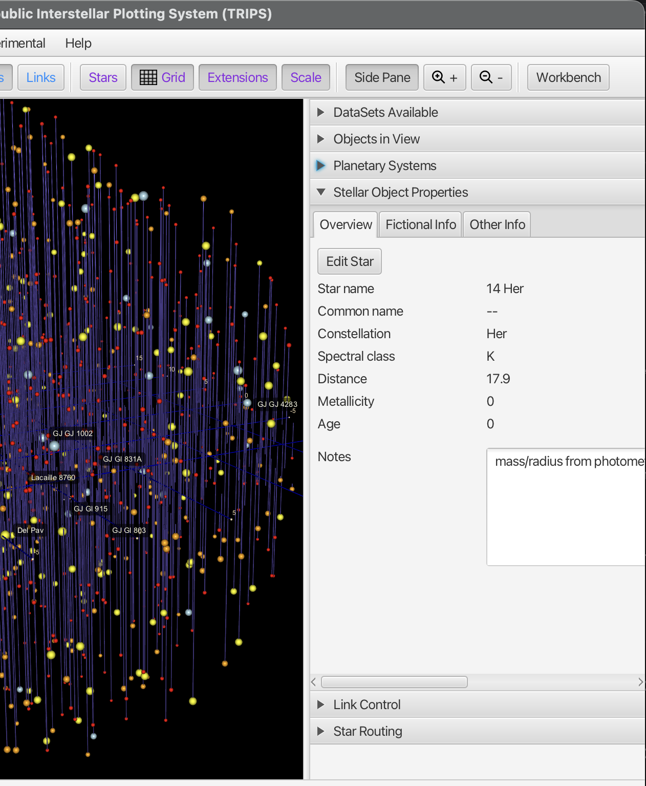
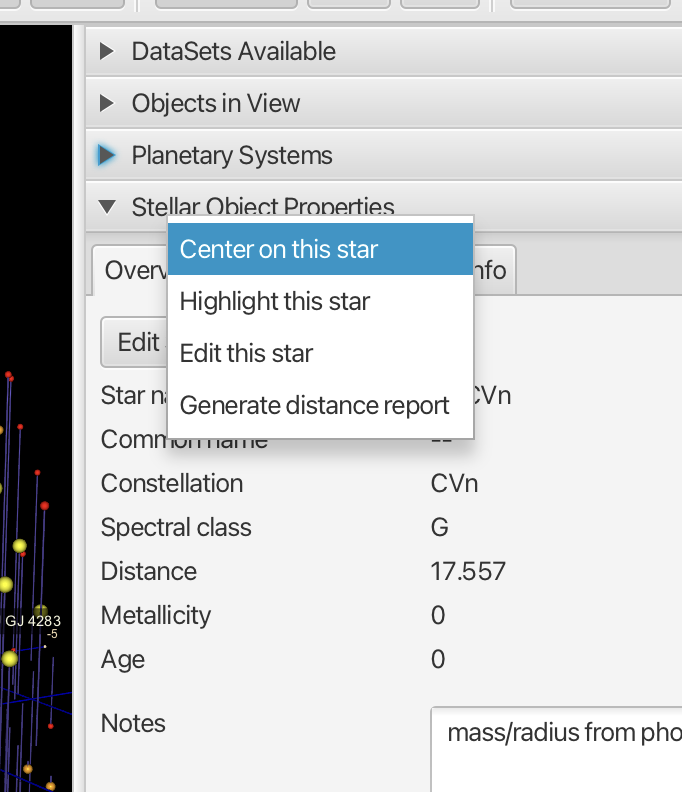
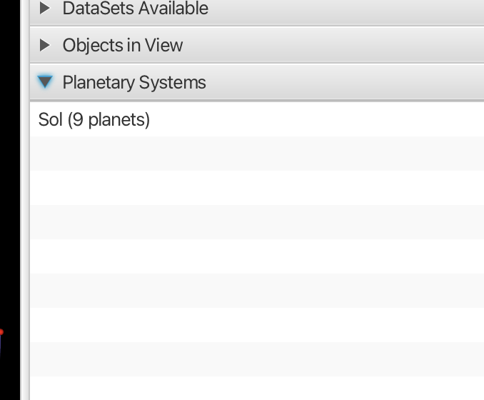
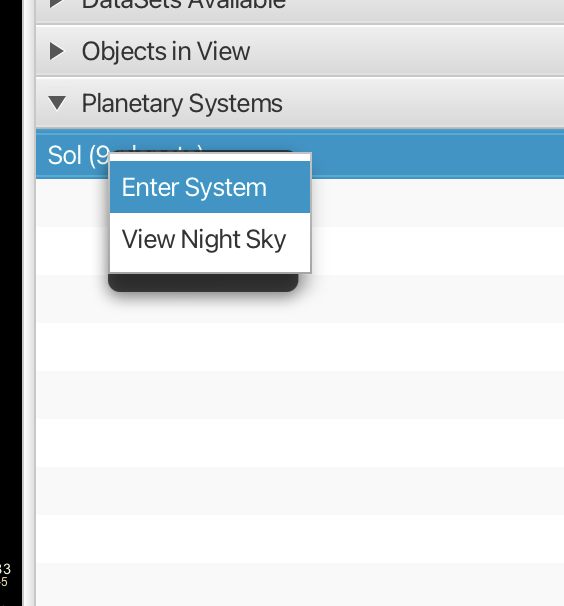

# Interstellar View

The Interstellar View is the primary 3D visualization in TRIPS, displaying stars as points in three-dimensional space. This is where you explore star fields, select objects, plan routes, and interact with stellar data.

## Navigation Controls

TRIPS provides multiple ways to navigate the 3D star field using mouse and keyboard.

### Mouse Controls

| Action | Result |
|--------|--------|
| **Left-click drag** | Rotate the view (pitch and yaw) |
| **Alt + left-click drag** | Roll the camera |
| **Ctrl + left-click drag** | Pan the camera |
| **Scroll wheel** | Zoom in/out |
| **Left-click on star** | Select the star |
| **Right-click on star** | Open context menu |

### Keyboard Controls

#### Continuous Navigation

| Key | Action |
|-----|--------|
| **W / S** | Zoom forward / backward |
| **A / D** | Strafe left / right |
| **Q / E** | Pan up / down |
| **Arrow Up / Down** | Pitch (rotate around X-axis) |
| **Arrow Left / Right** | Yaw (rotate around Z-axis) |
| **R / F** | Roll left / right |

#### Speed Modifiers

Hold these keys while navigating to change movement speed:

| Modifier | Effect |
|----------|--------|
| **Shift** | Fast (2x speed) |
| **Ctrl** | Slow/precise (0.25x speed) |
| **Shift + Ctrl** | Very fast (5x speed) |

#### Quick Actions

| Key | Action |
|-----|--------|
| **Escape** | Reset to default camera position |
| **Home** | Reset to initial view (centered on Sol) |
| **Space** | Toggle continuous rotation animation |

### Control Sense

The application supports two control modes that affect how directional inputs are interpreted:

- **Engineer mode**: Standard directional controls
- **Pilot mode**: Reversed controls (aircraft-style)

Configure this in **Edit > Preferences > User Controls**.

## Toolbar

The toolbar at the top of the window provides quick access to display toggles and actions.

### Action Buttons

| Button | Function |
|--------|----------|
| **Plot Stars** | Load and display the selected dataset |
| **Toggle Display on/off** | Master toggle for all display elements |
| **Side Pane** | Toggle the right-side control panel |
| **Q +** / **Q -** | Zoom in / zoom out |
| **Workbench** | Open the Data Workbench tool |

### Display Toggles

These buttons show/hide various visual elements. Active toggles are highlighted in color:

| Button | Color | Function |
|--------|-------|----------|
| **Star Labels** | Cyan | Show/hide star name labels |
| **Star Polities** | Cyan | Show/hide polity affiliation indicators |
| **Routes** | Red | Show/hide plotted routes |
| **Links** | Blue | Show/hide transit links between stars |
| **Stars** | Gray | Show/hide star objects |
| **Grid** | Blue | Show/hide the 3D coordinate grid |
| **Extensions** | Blue | Show/hide vertical lines from stars to the grid |
| **Scale** | Blue | Show/hide the scale legend |

## Selecting Stars

Click on any star to select it. The selected star's properties appear in the **Stellar Object Properties** section of the side panel.

### Objects in View List

The side panel's **Objects in View** section shows all stars currently visible in the 3D viewport, sorted by distance from the center point.

- **Single-click** a star in the list to select it and view its properties
- **Double-click** to recenter the view on that star

## Context Menu (Right-Click)

Right-clicking on a star opens a context menu with these options:

### Star Actions

| Option | Description |
|--------|-------------|
| **Highlight star** | Make the star blink for visual emphasis |
| **Properties** | Show full properties in the side panel |
| **Recenter on this star** | Move the camera to center on this star |
| **Edit star** | Open dialog to edit star properties |
| **Delete star** | Remove the star from the database |

### Routing Actions

| Option | Description |
|--------|-------------|
| **Run route finder/generator** | Open automated pathfinding dialog |
| **Build route on screen** | Start manual route creation mode |
| **Start Route** | Begin a new route with this star |
| **Continue Route** | Add this star to the current route |
| **Finish Route** | Complete and save the route |
| **Remove last link** | Undo the last waypoint |
| **Route: Start over** | Clear and restart route building |

### Reports

| Option | Description |
|--------|-------------|
| **Generate distance report** | Create a report of distances from this star |

### Solar System

| Option | Description |
|--------|-------------|
| **Enter System** | Jump into the Solar System view |
| **Generate Simulated Solar System** | Create a procedural planetary system |
| **Edit notes** | Add or edit notes for this star |

## Side Panel

Click **Side Pane** in the toolbar to reveal the control panel on the right side of the window. The panel contains expandable accordion sections—click on a section header to expand it.

### DataSets Available

Lists all loaded datasets with their star counts. Select a dataset to make it active for plotting.

### Objects in View

Shows all stars visible in the current viewport. Each entry displays the star name and its (x, y, z) coordinates in light-years.

- **Single-click** a star to select it and view its properties
- **Double-click** to recenter the view on that star

### Stellar Object Properties

Displays detailed information about the selected star across three tabs:

- **Overview**: Star name, common name, constellation, spectral class, distance, metallicity, age, and notes
- **Fictional Info**: Polity, world type, tech level, population (for science fiction use)
- **Other Info**: Additional catalog IDs and technical data

Click **Edit Star** to modify the star's attributes.

**Right-click** on the properties panel to access quick actions:

- **Center on this star**: Move camera to focus on this star
- **Highlight this star**: Make the star blink for emphasis
- **Edit this star**: Open the full edit dialog
- **Generate distance report**: Create a report of distances from this star

### Link Control

Configure transit rules including jump distance limits and type filters. Define which star connections are valid for routing.

### Planetary Systems

Lists star systems with known planets in the current view. Shows the system name and planet count.

**Right-click** on a system to access these options:

- **Enter System**: Jump into the Solar System view to explore planets
- **View Night Sky**: See the sky as it appears from that star system

### Star Routing

Displays routes being built or viewed. Shows waypoints with distances between jumps. Options to save, export, or modify routes.

## Display Overlays

### Star Appearance

Stars are displayed as colored spheres based on their spectral class:

| Spectral Class | Color | Examples |
|----------------|-------|----------|
| O | Blue | Hot, massive stars |
| B | Blue-white | Bright blue giants |
| A | White | Sirius, Vega |
| F | Yellow-white | Procyon |
| G | Yellow | Sol (our Sun) |
| K | Orange | Alpha Centauri B |
| M | Red | Proxima Centauri, Barnard's Star |

Star size in the display can be based on magnitude or luminosity (configurable in preferences).

### Coordinate Grid

The 3D grid provides spatial reference in the XY plane (horizontal at Z=0). Grid squares represent light-year divisions, with the scale shown in the bottom-right corner.

### Extensions (Stem Lines)

Vertical lines connecting stars to the grid plane help visualize Z-axis positions. These "stems" make it easier to see where each star sits in 3D space relative to the grid. Toggle with the **Extensions** button.

### Star Labels

Labels display star names as billboard-style text that always faces the camera. The number of visible labels depends on zoom level and is configurable in preferences.

### Scale Legend

Shows "Scale: 1 grid is X light-years square" in the bottom-right corner. Updates dynamically as you zoom.

### Routes

Plotted routes appear as colored line segments connecting star waypoints. Multiple routes can display simultaneously with different colors.

### Links (Transit Connections)

Link lines show possible jump connections between stars within the maximum transit distance. These represent the "road network" for route planning. Toggle with the **Links** button.

### Polity Indicators

Visual markers on stars showing political affiliation. Colors are customizable per dataset theme.

## Status Bar

The status bar at the bottom of the window displays:

- **Plot Status**: Shows which dataset is currently plotted (e.g., "Dataset plotted is selection from: at-20ly")
- **Routing State**: Indicates whether route building is active or inactive

## Coordinate System

- **Origin**: Sol (Earth's Sun) at coordinates (0, 0, 0)
- **Units**: Light-years
- **System**: Right-handed 3D coordinate system

The grid displays axis labels showing distance from the origin in light-years. In the screenshot, the grid ranges from -15 to +15 light-years on each axis.

## Tips

- Use **Escape** to quickly reset your view if you get disoriented
- Hold **Shift** while navigating to move faster through large star fields
- Enable **Extensions** to better understand the vertical distribution of stars
- Use the **Objects in View** list to quickly jump to specific stars
- Right-click **Recenter on this star** to focus your exploration on a region

## Related Topics

- [Searching, Querying, and Editing Stars](searching-and-editing-stars.md)
- [Route Planning](route-planning.md)
- [Solar System View](solar-system-view.md)
- [Preferences and Settings](preferences-and-settings.md)
