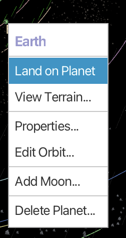
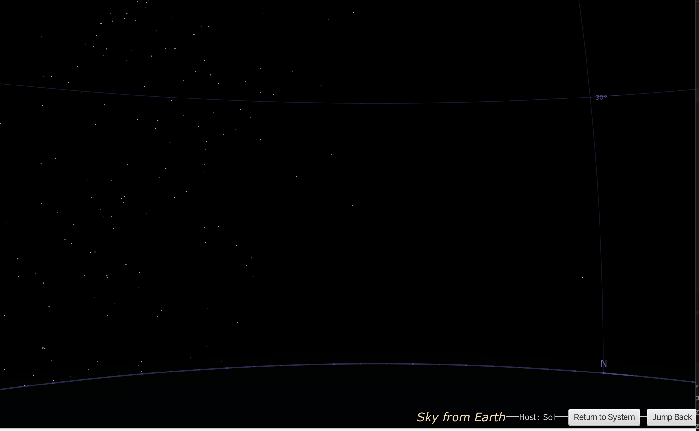

# Night Sky View

The Night Sky view simulates the sky as seen from the surface of a planet, showing stars, planets, and celestial reference lines.

## Opening the Night Sky View

In the Solar System view, right-click on any planet and select **Land on Planet**:

This takes you to the Night Sky view from that planet's surface.

## The Night Sky Display

The Night Sky view shows:

- **Stars**: White points representing visible stars from this location
- **Star labels**: Named stars are labeled (e.g., "Sheratan")
- **Planets**: Solar system planets visible from this location (e.g., "Mars")
- **Horizon**: Blue curved line at the bottom representing the horizon
- **Direction markers**: Cardinal directions (N, E, S, W) along the horizon
- **Grid lines**: Celestial coordinate reference grid

## What You Can See

From Earth's surface in the simulation, you can observe:

- **Nearby stars**: Stars within the loaded dataset, properly positioned based on their actual coordinates
- **Planets**: Other planets in the solar system at their simulated positions
- **Coordinate grid**: Lines showing celestial coordinates for reference

## Navigation

- **Drag**: Pan the view to look in different directions
- **Scroll**: Adjust field of view (zoom)
- **Horizon**: The curved line shows where the sky meets the ground

## Use Cases

The Night Sky view is useful for:

- **Science fiction writing**: See how the sky would look from an alien planet
- **Astronomical education**: Understand star positions from different viewpoints
- **World-building**: Determine which stars would be visible from your fictional worlds
- **Navigation planning**: Understand which stars could serve as navigation references

## Returning to Other Views

Use the navigation controls or menu to return to:
- Solar System view
- Interstellar view

## Alternative Access

You can also access the Night Sky view from the side panel in the Interstellar view:

1. Expand the **Planetary Systems** section
2. Right-click on a star system (e.g., "Sol (9 planets)")
3. Select **View Night Sky**

## Related Topics

- [Solar System View](solar-system-view.md)
- [Interstellar View](interstellar-view.md)
- [Procedural Planets](procedural-planets.md)
