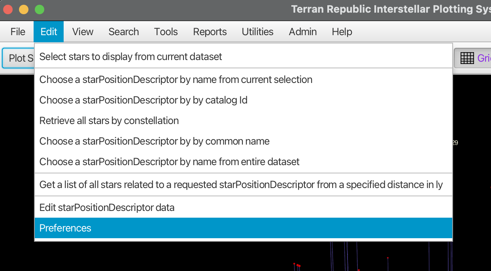
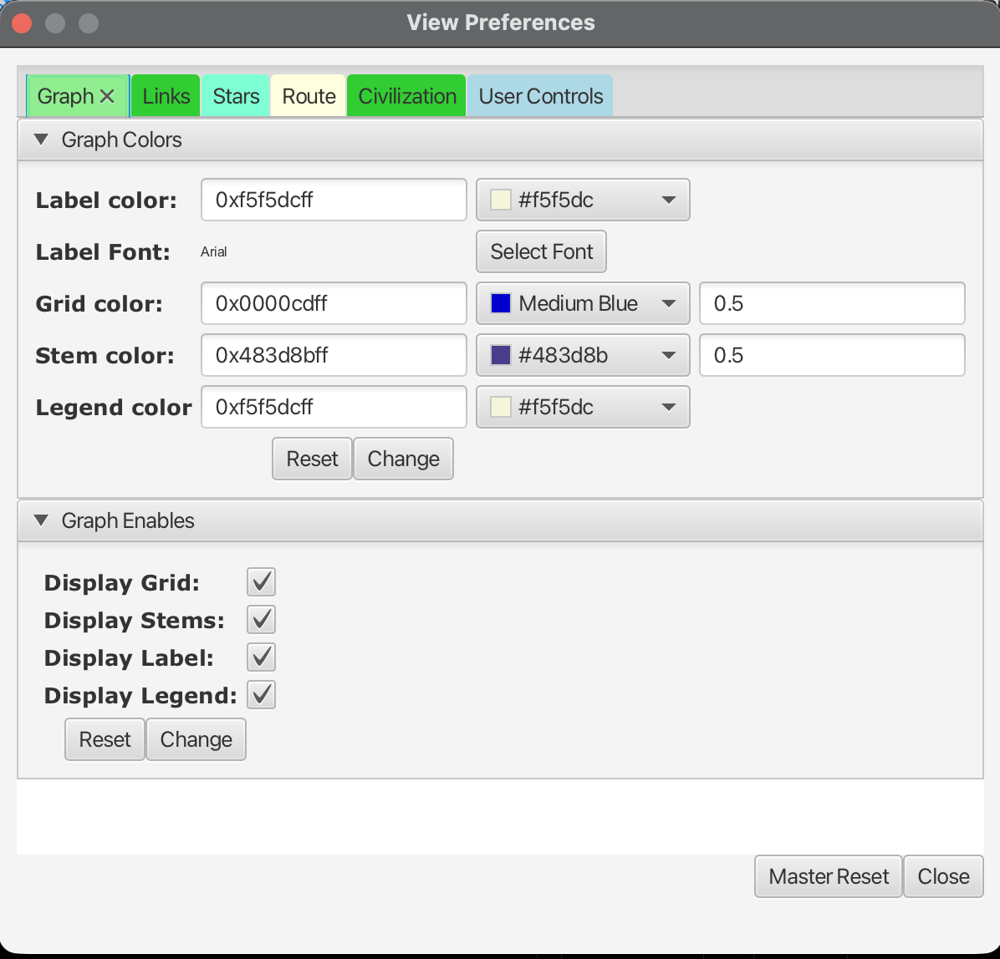
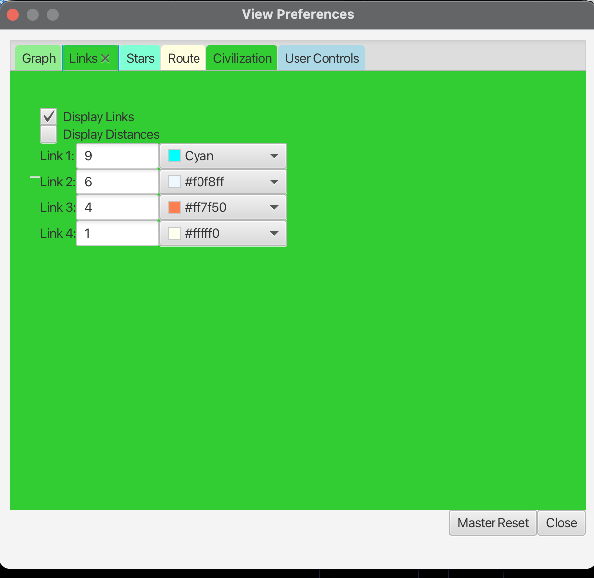
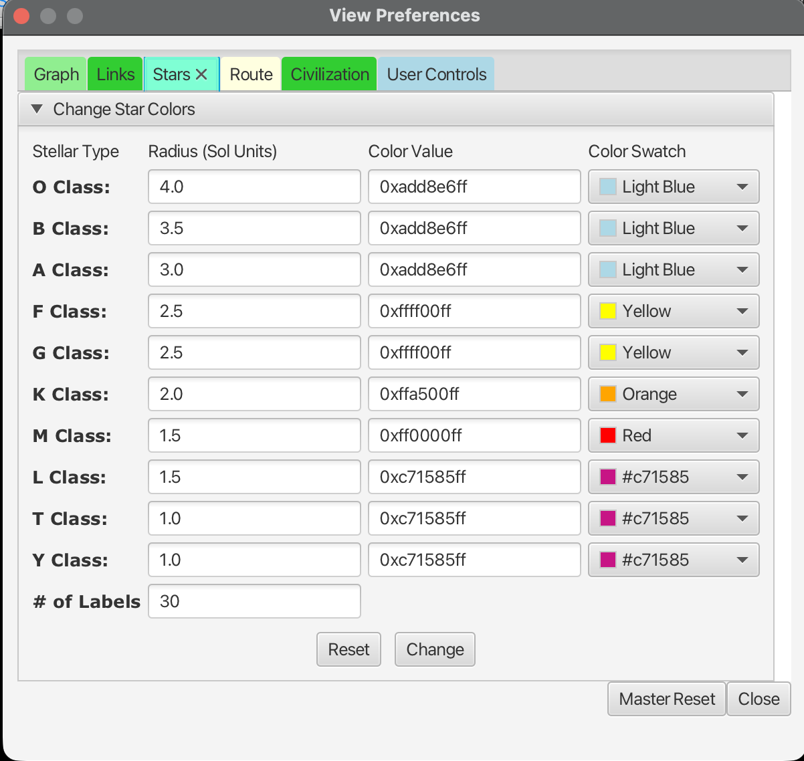
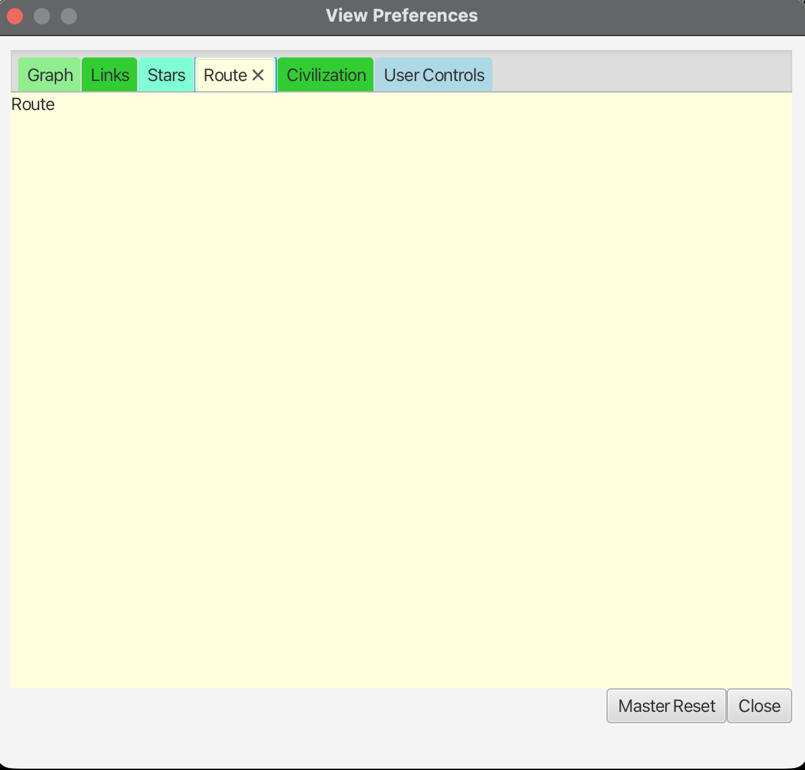
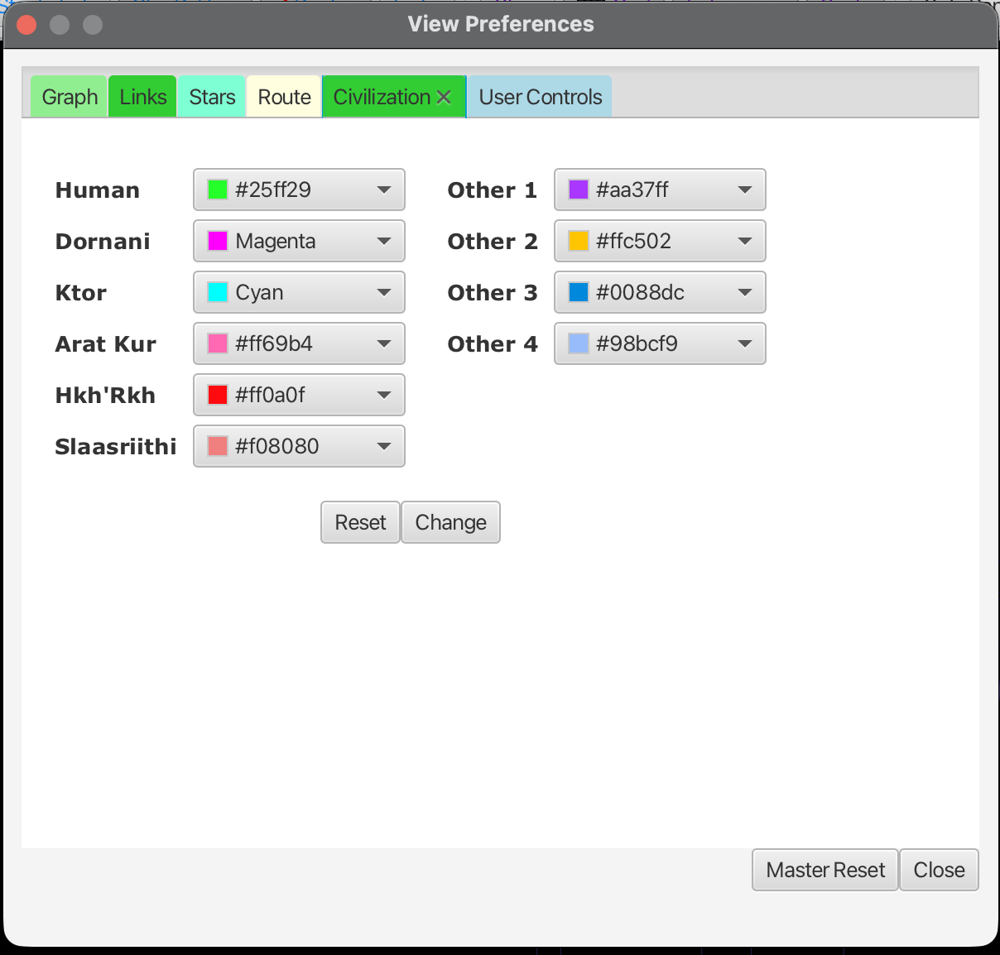
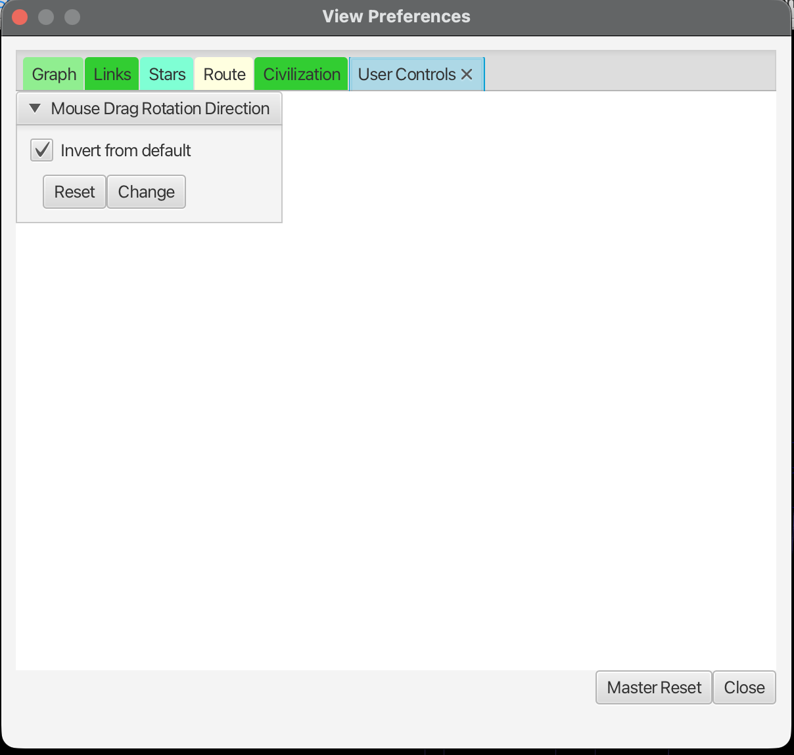

# Preferences and Settings

TRIPS provides extensive customization options for colors, display elements, and controls through the View Preferences dialog.

## Accessing Preferences

To open the preferences dialog, select **Edit → Preferences** from the menu bar:

The View Preferences dialog has six tabs: **Graph**, **Links**, **Stars**, **Route**, **Civilization**, and **User Controls**.

Each tab has **Reset** and **Change** buttons:
- **Reset**: Restore default values for that section
- **Change**: Apply your modifications

At the bottom of the dialog:
- **Master Reset**: Reset ALL preferences to defaults
- **Close**: Close the dialog

## Graph Tab

The Graph tab controls the overall appearance of the 3D visualization.

### Graph Colors

- **Label color**: Color for star name labels
- **Label Font**: Font used for labels (click **Select Font** to change)
- **Grid color**: Color of the reference grid (includes opacity value)
- **Stem color**: Color of the vertical lines connecting stars to the grid
- **Legend color**: Color for the legend text

Each color can be entered as a hex value or selected from the color picker dropdown.

### Graph Enables

Toggle visibility of display elements:
- **Display Grid**: Show/hide the reference grid
- **Display Stems**: Show/hide vertical stem lines
- **Display Label**: Show/hide star name labels
- **Display Legend**: Show/hide the scale legend

## Links Tab

The Links tab controls how transit connections between stars are displayed.

- **Display Links**: Show/hide transit links in the view
- **Display Distances**: Show/hide distance labels on links

### Link Distance Colors

Links can be color-coded by distance. Configure up to four distance thresholds:
- **Link 1**: Longest range links (default: 9 ly, Cyan)
- **Link 2**: Medium-long range (default: 6 ly)
- **Link 3**: Medium-short range (default: 4 ly)
- **Link 4**: Shortest range (default: 1 ly)

Each link tier has a distance threshold and color setting.

## Stars Tab

The Stars tab lets you customize how different stellar types appear in the visualization.

### Stellar Type Settings

For each spectral class, you can set:
- **Radius (Sol Units)**: Display size relative to Sol
- **Color Value**: Hex color code
- **Color Swatch**: Visual color picker

Available spectral classes:
| Class | Default Size | Default Color |
|-------|-------------|---------------|
| O Class | 4.0 | Light Blue |
| B Class | 3.5 | Light Blue |
| A Class | 3.0 | Light Blue |
| F Class | 2.5 | Yellow |
| G Class | 2.5 | Yellow |
| K Class | 2.0 | Orange |
| M Class | 1.5 | Red |
| L Class | 1.5 | Magenta |
| T Class | 1.0 | Magenta |
| Y Class | 1.0 | Magenta |

- **# of Labels**: Maximum number of star labels to display (default: 30)

## Route Tab

The Route tab is reserved for route display settings.

Route preferences are currently minimal. Future versions may include route color and style options.

## Civilization Tab

The Civilization tab sets colors for different polities (political entities/civilizations). This is useful for science fiction world-building scenarios.

### Polity Colors

Pre-defined civilizations:
- **Human**: Green (#25ff29)
- **Dornani**: Magenta
- **Ktor**: Cyan
- **Arat Kur**: Pink (#ff69b4)
- **Hkh'Rkh**: Red (#ff0a0f)
- **Slaasriithi**: Coral (#f08080)

Additional slots for custom civilizations:
- **Other 1** through **Other 4**

These colors are used when stars are assigned to polities, allowing you to visualize territorial boundaries or spheres of influence.

## User Controls Tab

The User Controls tab adjusts how you interact with the 3D view.

### Mouse Drag Rotation Direction

- **Invert from default**: When checked, reverses the direction of rotation when dragging the mouse in the 3D view

This is useful if you find the default rotation direction counterintuitive.

## Tips

- Changes take effect after clicking **Change** in each section
- Use **Master Reset** if you want to return all settings to their original defaults
- If preferences appear to reset unexpectedly, confirm the app has write access to the local database
- Color values can be entered as hex codes (e.g., `0xff0000ff` or `#ff0000`) or selected from the dropdown
