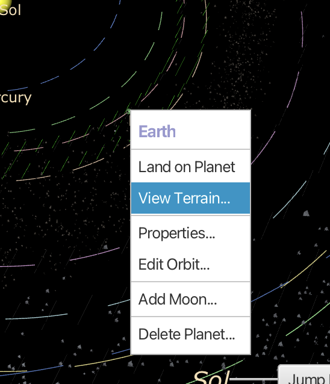
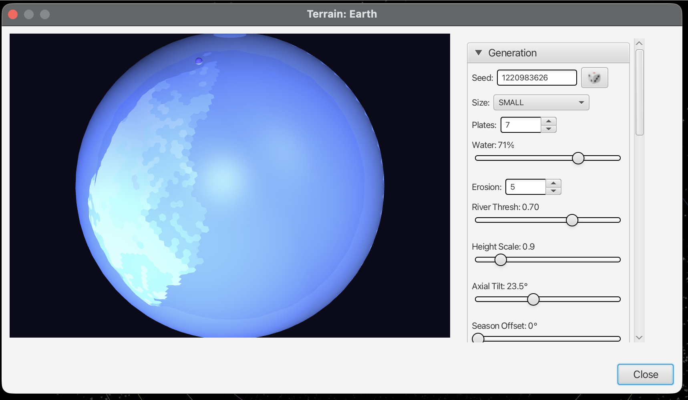

# Procedural Planets

TRIPS can generate procedural planets with configurable terrain, oceans, and atmospheric properties. This is useful for science fiction world-building or visualizing hypothetical planets.

## Opening the Terrain Viewer

In the Solar System view, right-click on any planet to open the context menu:

Select **View Terrain...** to open the terrain generation viewer.

## The Terrain Viewer

The terrain viewer shows a 3D globe with procedurally generated terrain on the left, and generation controls on the right.

## Generation Parameters

### Seed

The **Seed** value (e.g., 1220983626) determines the random pattern of terrain generation. Use the same seed to reproduce exactly the same planet. Click the dice button to generate a new random seed.

### Size

Controls the resolution/detail level of the generated terrain:
- **SMALL**: Fast generation, lower detail
- **MEDIUM**: Balanced
- **LARGE**: High detail, slower generation

### Plates

The number of tectonic plates (e.g., 7). More plates create more complex coastlines and mountain ranges.

### Water

The percentage of the planet's surface covered by water (e.g., 71% for Earth-like). Adjust to create:
- **0-20%**: Desert world
- **40-60%**: Mixed terrain
- **70-90%**: Ocean world
- **95-100%**: Water world

### Erosion

Controls the level of terrain erosion (e.g., 5). Higher values smooth terrain and create river valleys.

### River Thresh

River threshold (e.g., 0.70). Controls where rivers form based on water flow accumulation.

### Height Scale

Vertical exaggeration of terrain (e.g., 0.9). Higher values create more dramatic mountains and valleys.

### Axial Tilt

The planet's axial tilt in degrees (e.g., 23.5° for Earth). Affects:
- Season intensity
- Climate zone distribution
- Day/night patterns at poles

### Season Offset

Starting position in the planet's seasonal cycle (0° to 360°).

## Generating Terrain

1. Adjust the parameters as desired
2. The terrain updates automatically as you change values
3. Rotate the globe by dragging to view different regions
4. Click **Close** when finished

## Tips

- **Reproducibility**: Save the seed value to recreate a specific planet
- **Tectonic complexity**: Use 5-10 plates for realistic continent distribution
- **Earth-like planets**: Use Water ~71%, Plates 7, Axial Tilt 23.5°
- **Mars-like**: Water 0%, Erosion 2, Height Scale 1.2
- **Ocean worlds**: Water 90%+, low plate count

## Accessing from the Interstellar View

You can also generate procedural terrain from the Interstellar view:

1. Right-click on a star
2. Select **Generate Simulated Solar System from this star**
3. Enter the generated system
4. Right-click on planets to view/edit their terrain

## Related Topics

- [Solar System View](solar-system-view.md)
- [Night Sky View](night-sky-view.md)
