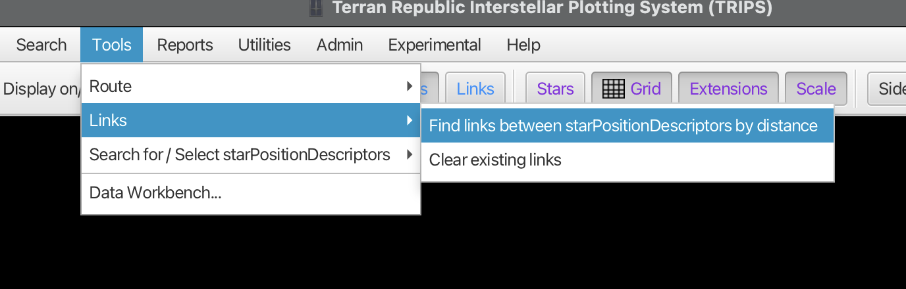
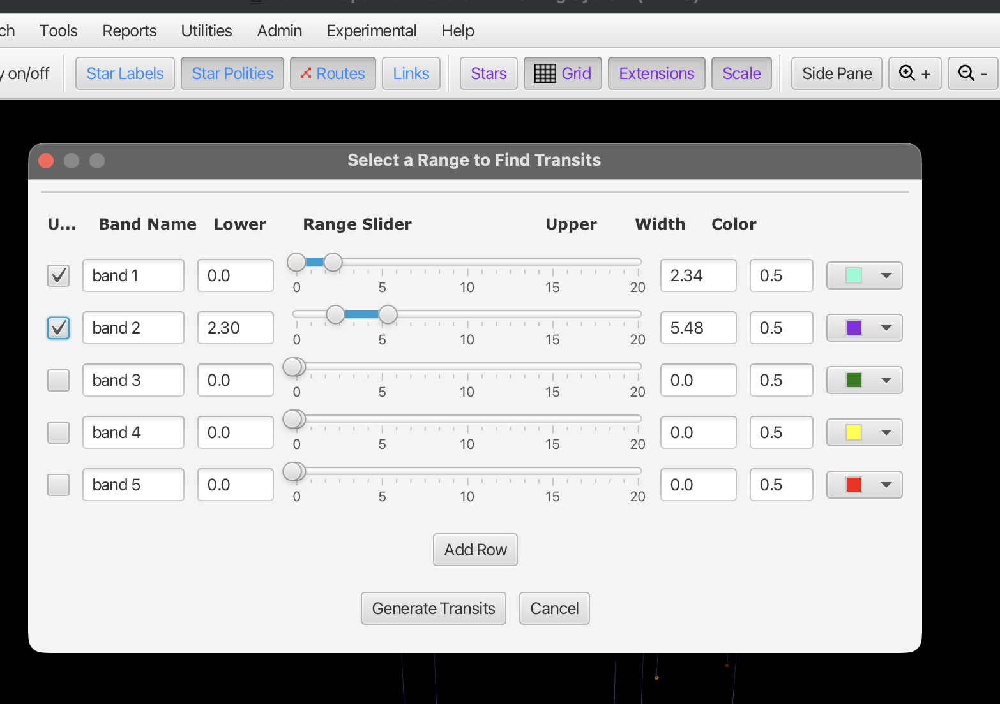
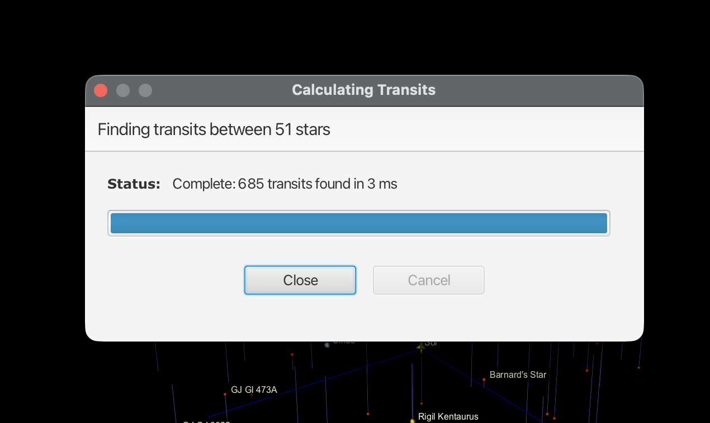
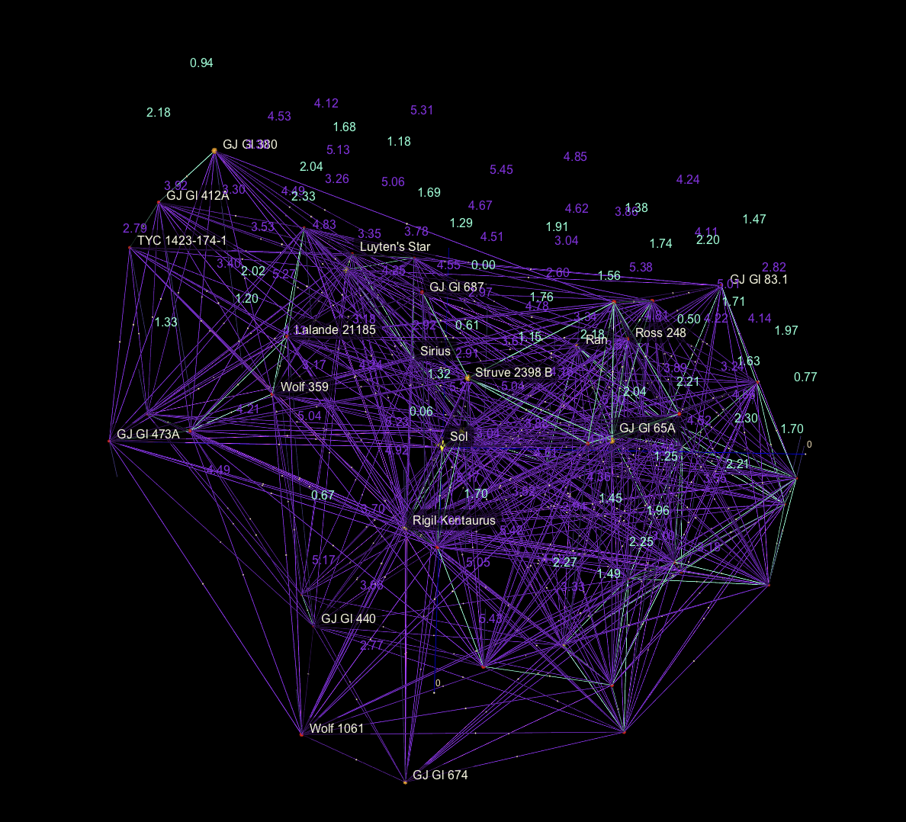
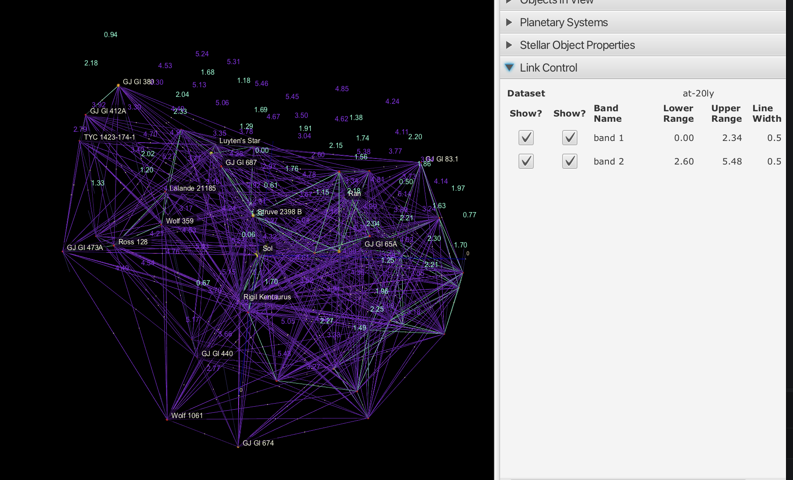
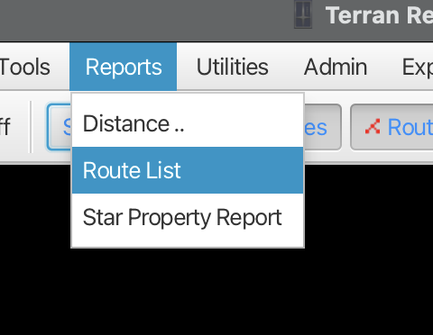
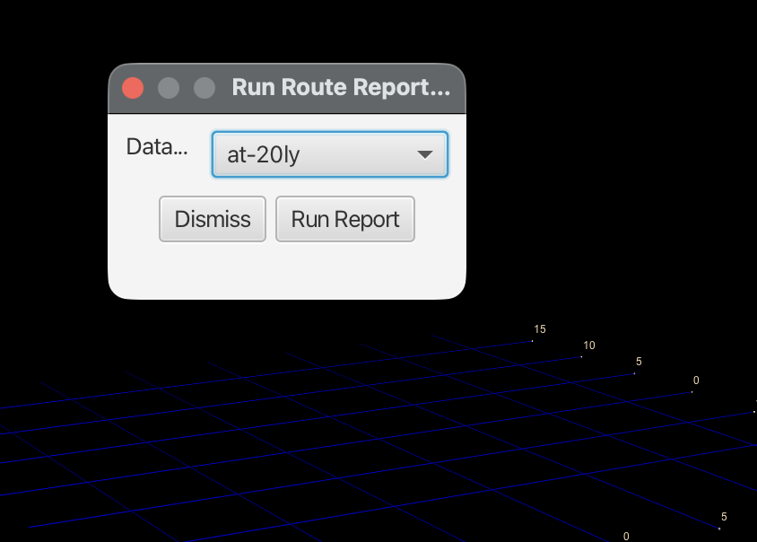

# Route Planning

TRIPS includes route planning for interstellar travel paths between star systems. Before planning routes, you need to generate transit links—the possible "jumps" between stars that form the road network for pathfinding.

## Understanding Transits and Links

**Transits** (also called **Links**) are potential direct connections between pairs of stars. They represent the "roads" that routes can follow. A transit exists between two stars if they are within a specified maximum jump distance.

## Generating Transit Links

### Opening the Transit Dialog

Go to **Tools > Links > Find links between starPositionDescriptors by distance**:

This opens the transit range configuration dialog.

### Configuring Transit Bands

The dialog lets you define multiple **distance bands** for transits. Each band represents a range of jump distances with its own color coding.

For each band, configure:

| Field | Description |
|-------|-------------|
| **Use** | Checkbox to enable this band |
| **Band Name** | Label for this distance range (e.g., "band 1", "short jumps") |
| **Lower** | Minimum distance in light-years |
| **Range Slider** | Visual control for setting the distance range (0-20 ly) |
| **Upper** | Maximum distance in light-years |
| **Width** | Line thickness for display |
| **Color** | Color for links in this band |

#### Example Configuration

In the screenshot:
- **Band 1** (cyan): 0.0 to 2.34 light-years - very short jumps
- **Band 2** (purple): 2.30 to 5.48 light-years - medium jumps

Click **Add Row** to add more bands if needed.

### Generating Transits

Click **Generate Transits** to calculate all possible links. A progress dialog shows the calculation:

The status shows:
- Number of stars being processed
- Number of transits found
- Time taken

Click **Close** when complete.

### Viewing Transit Links

Once generated, transit links appear as colored lines connecting stars:

Each link shows:
- **Colored line**: Indicates the distance band (cyan for short, purple for medium)
- **Distance label**: The exact distance in light-years between the connected stars

The transit network reveals the connectivity structure of your star field—which stars can reach which others within your specified jump limits.

### Controlling Link Display

Use the **Link Control** panel in the side pane to toggle which bands are visible:

The panel shows:
- **Dataset**: Which dataset these transits belong to
- **Show?** columns: Toggle visibility of each band
- **Band Name**: The label you assigned
- **Lower/Upper Range**: The distance limits
- **Line Width**: Display thickness

You can also toggle all links on/off using the **Links** button in the toolbar.

### Clearing Links

To remove existing transit links, go to **Tools > Links > Clear existing links**:

This removes all calculated transits from the display. You'll need to regenerate transits if you want to see them again.

## Planning a Route

Once transits are generated, you can plan routes between stars.

### Manual Route Building

1. Right-click on a star and select **Start Route**
2. Click additional stars to add waypoints
3. Right-click and select **Continue Route** to add each star
4. Right-click and select **Finish Route** to complete

### Automatic Route Finding

1. Right-click on a star and select **Run route finder/generator**
2. Select your destination star
3. Configure pathfinding options (maximum distance, preferred bands)
4. Click to generate the optimal route

The pathfinder uses graph algorithms to find the shortest path through the transit network.

## Viewing Routes

Routes are displayed as colored line segments connecting waypoints. Each segment shows the distance of that jump.

Toggle route visibility with the **Routes** button in the toolbar.

## The Star Routing Panel

The side panel's **Star Routing** section shows:
- Current route waypoints in sequence
- Total route distance
- Individual jump distances
- Options to save, export, or modify the route

## Reports

The **Reports** menu provides route and distance reports:

### Route List Report

Select **Reports > Route List** to generate a report of all routes in the current dataset:

Select the dataset and click **Run Report** to generate a list of all saved routes with their waypoints and distances.

### Distance Report

Select **Reports > Distance..** to generate a distance report from a selected star to all other visible stars.

### Star Property Report

Select **Reports > Star Property Report** to generate a comprehensive report of star properties for the current selection.

## Tips

- **Shorter bands = more hops**: Using only short-range transits means more stops but may avoid difficult long jumps
- **Multiple bands**: Define several bands to see both short and long connection options
- **Clear before regenerating**: Clear existing links before generating new ones with different parameters
- **Large datasets**: For datasets with thousands of stars, transit calculation may take longer—use distance filters to limit the search

## Related Topics

- [Interstellar View](interstellar-view.md)
- [Searching, Querying, and Editing Stars](searching-and-editing-stars.md)
