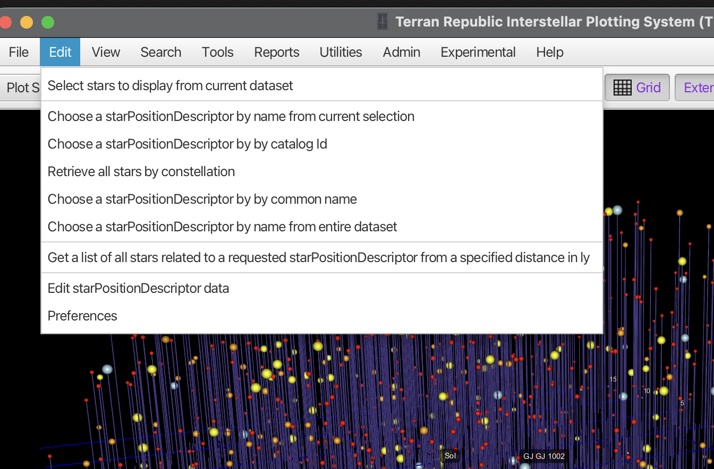
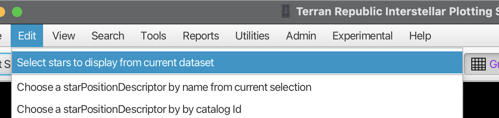
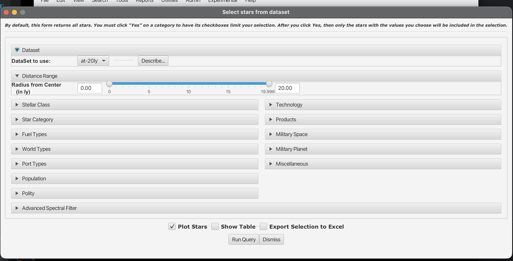
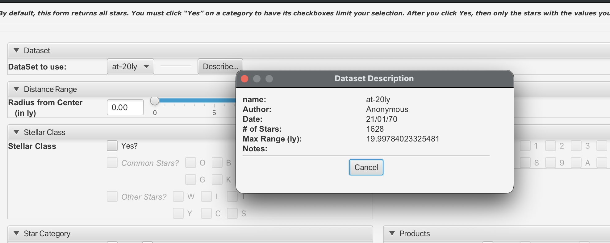
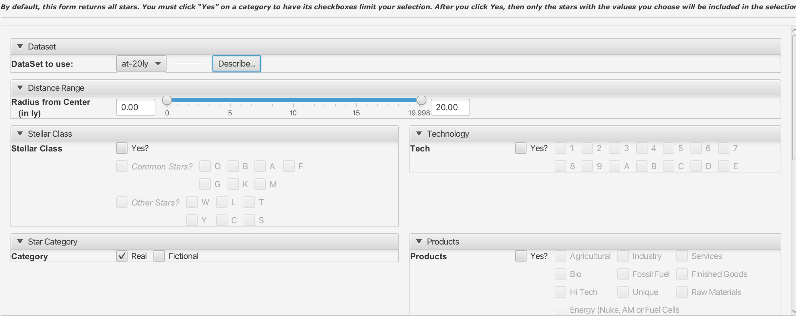
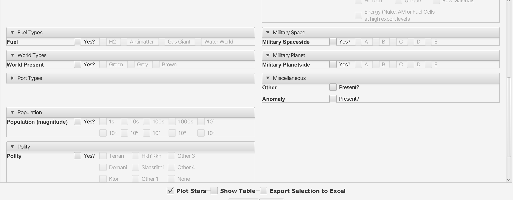
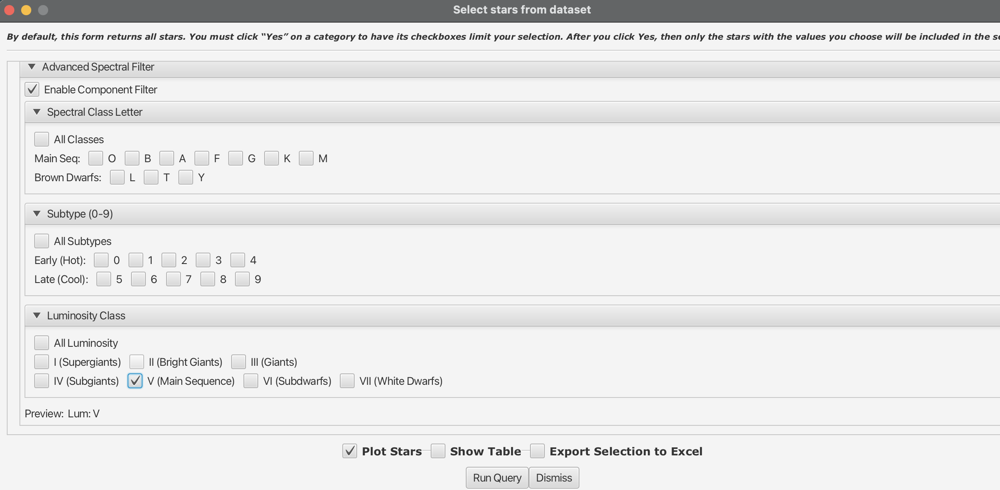
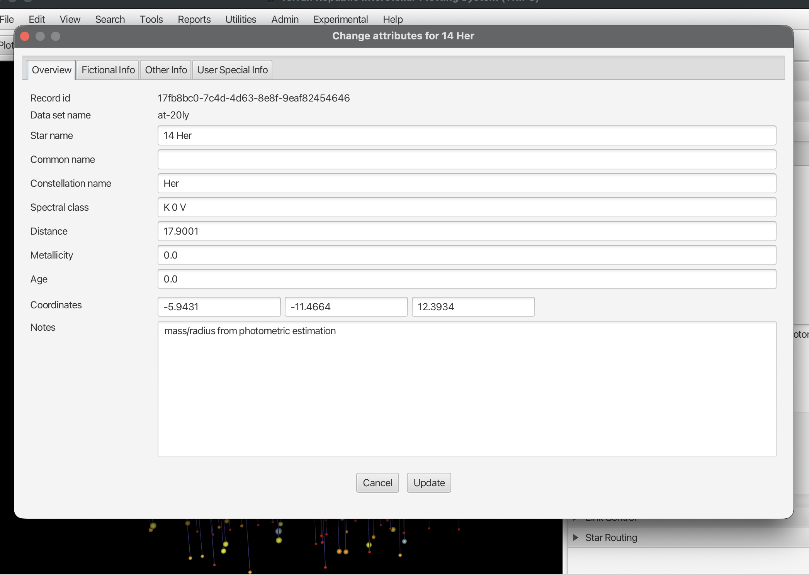

# Searching, Querying, and Editing Stars

TRIPS provides multiple ways to find specific stars and edit their data.

## Finding Stars

### Using the Edit Menu

The **Edit** menu provides several search options:

| Menu Option | Description |
|-------------|-------------|
| **Select stars to display from current dataset** | Open query dialog to filter which stars are plotted |
| **Choose a star by name from current selection** | Find a star by name among currently displayed stars |
| **Choose a star by catalog Id** | Search by HIP, HD, Gliese, or other catalog numbers |
| **Retrieve all stars by constellation** | Display all stars in a specific constellation |
| **Choose a star by common name** | Search by familiar names (e.g., "Sirius", "Proxima") |
| **Choose a star by name from entire dataset** | Search the full database, not just plotted stars |
| **Get a list of all stars within distance** | Find neighbors within a specified light-year radius |

### Using the Objects in View List

The side panel's **Objects in View** section lists all currently visible stars with their coordinates. Click any star to select it and view its properties.

### Using the Search Menu

The **Search** menu provides additional query options for filtering the display by various criteria including distance, spectral class, and custom attributes.

## The Query Dialog

The most powerful way to filter stars is the comprehensive query dialog. Open it via **Edit > Select stars to display from current dataset**:

### Query Dialog Overview

The query dialog lets you filter stars by many criteria. By default, all stars are returned. To filter by a category, you must check its **Yes?** checkbox—then only stars matching your selected values will be included.

The dialog is organized into expandable sections. Click a section header to expand or collapse it.

### Dataset Section

Select which dataset to query from the dropdown. Click **Describe...** to see dataset details:

The description shows:
- Dataset name and author
- Creation date
- Number of stars
- Maximum distance range
- Any notes about the dataset

### Distance Range

Use the slider or text fields to set the minimum and maximum distance from Sol (in light-years). This is useful for focusing on nearby stars or a specific distance shell.

### Astronomical Filters

#### Stellar Class

Filter by spectral type:
- **Common Stars**: O, B, A, F, G, K, M (main sequence and giant stars)
- **Other Stars**: W (Wolf-Rayet), L, T, Y (brown dwarfs), C (carbon stars), S (S-type)

#### Star Category

- **Real**: Actual stars from astronomical catalogs
- **Fictional**: User-created or science fiction stars

### Science Fiction Filters

These filters are useful for science fiction world-building scenarios:

#### Fuel Types

Filter by available fuel sources:
- H2 (Hydrogen)
- Antimatter
- Gas Giant (for fuel skimming)
- Water World

#### World Types

Filter by planet type:
- Green (habitable)
- Grey (industrial/barren)
- Brown (desert/arid)

#### Port Types

Filter by starport classification.

#### Population

Filter by population magnitude:
- 1s, 10s, 100s, 1000s (small settlements)
- 10⁴ through 10⁹ (larger populations)

#### Polity

Filter by political affiliation:
- Terran, Dornani, Hkh'Rkh, Slaasriithi, Ktor
- Other 1-4, None

#### Technology

Filter by tech level (1-9, A-E).

#### Products

Filter by available products/exports:
- Agricultural, Industry, Services
- Bio, Fossil Fuel, Finished Goods
- Hi Tech, Unique, Raw Materials
- Energy (nuclear, antimatter, or fuel cells)

#### Military Space / Military Planet

Filter by military presence level (A-E) for space-based or planetary forces.

#### Miscellaneous

- **Other Present?**: Has other notable features
- **Anomaly Present?**: Has scientific anomalies

### Advanced Spectral Filter

For precise stellar classification filtering, expand the **Advanced Spectral Filter** section and check **Enable Component Filter**.

#### Spectral Class Letter

Select specific spectral types:
- **Main Sequence**: O, B, A, F, G, K, M
- **Brown Dwarfs**: L, T, Y

#### Subtype (0-9)

Filter by temperature subclass:
- **Early (Hot)**: 0, 1, 2, 3, 4
- **Late (Cool)**: 5, 6, 7, 8, 9

#### Luminosity Class

Filter by stellar luminosity:
- **I**: Supergiants
- **II**: Bright Giants
- **III**: Giants
- **IV**: Subgiants
- **V**: Main Sequence (most common)
- **VI**: Subdwarfs
- **VII**: White Dwarfs

The **Preview** line shows your current filter selection (e.g., "Lum: V" for main sequence stars only).

### Running the Query

At the bottom of the dialog:

- **Plot Stars**: Check to display results in the 3D view
- **Show Table**: Check to display results in a table view
- **Export Selection to Excel**: Check to export results to a spreadsheet

Click **Run Query** to execute your filter. Click **Dismiss** to close without querying.

## Viewing Star Properties

When you select a star, its details appear in the **Stellar Object Properties** panel:

The panel has three tabs:

### Overview Tab

- **Star name**: Primary designation
- **Common name**: Familiar name (if any)
- **Constellation**: Three-letter constellation abbreviation
- **Spectral class**: Stellar classification (O, B, A, F, G, K, M)
- **Distance**: Distance from Sol in light-years
- **Metallicity**: Metal content relative to the Sun
- **Age**: Estimated age in billions of years
- **Notes**: Free-text notes about the star

### Fictional Info Tab

Fields for science fiction world-building:

- Polity affiliation
- World type
- Fuel availability
- Tech level
- Port classification
- Population
- Military presence

### Other Info Tab

Additional technical data including:

- Catalog IDs (SIMBAD, Gaia, 2MASS, etc.)
- Galactic coordinates
- Proper motion
- Radial velocity
- Magnitude values

## Editing Star Data

### Opening the Edit Dialog

There are several ways to edit a star:

1. **From the side panel**: Click **Edit Star** in the Stellar Object Properties section
2. **From the context menu**: Right-click on a star in the 3D view and select **Edit star**
3. **From the properties context menu**: Right-click in the Stellar Object Properties panel and select **Edit this star**

### The Edit Dialog

The edit dialog has four tabs:

#### Overview Tab

Edit basic star information:

- **Star name**: Primary designation
- **Common name**: Familiar name
- **Constellation name**: Three-letter abbreviation
- **Spectral class**: Full spectral classification (e.g., "K 0 V")
- **Distance**: Distance from Sol in light-years
- **Metallicity**: Metal content value
- **Age**: Estimated age
- **Coordinates**: X, Y, Z position in light-years
- **Notes**: Free-text notes

#### Fictional Info Tab

Edit science fiction attributes for world-building.

#### Other Info Tab

Edit additional technical data and catalog identifiers.

#### User Special Info Tab

Edit custom user-defined fields specific to your dataset.

### Saving Changes

Click **Update** to save your changes, or **Cancel** to discard them.

## Quick Actions

Right-click on the Stellar Object Properties panel for quick actions:

- **Center on this star**: Move the camera to center on the selected star
- **Highlight this star**: Make the star blink for visual emphasis
- **Edit this star**: Open the full edit dialog
- **Generate distance report**: Create a report showing distances from this star to all others

## Tips

- Use **Edit > Choose a star by common name** to quickly find well-known stars
- The **Coordinates** fields in the edit dialog show the star's position relative to Sol at (0, 0, 0)
- Notes are useful for recording observations or science fiction details about stars
- Changes are saved to the local database immediately when you click **Update**

## Related Topics

- [Interstellar View](interstellar-view.md)
- [Datasets and Imports](datasets-and-imports.md)
- [Preferences and Settings](preferences-and-settings.md)
