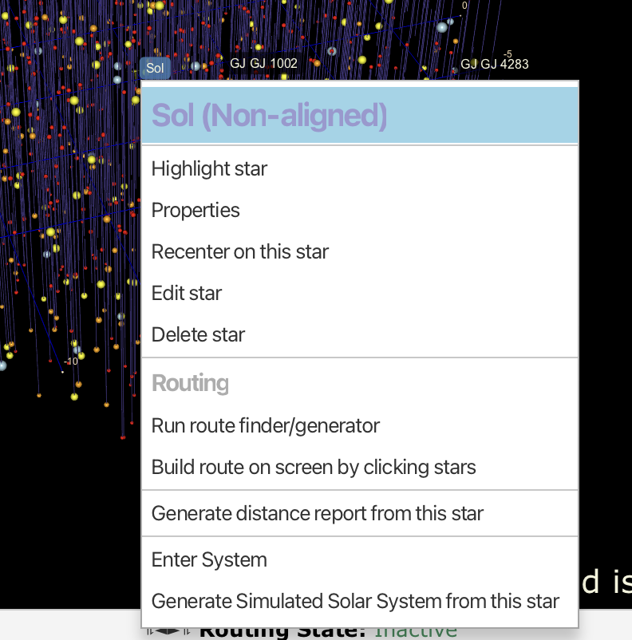
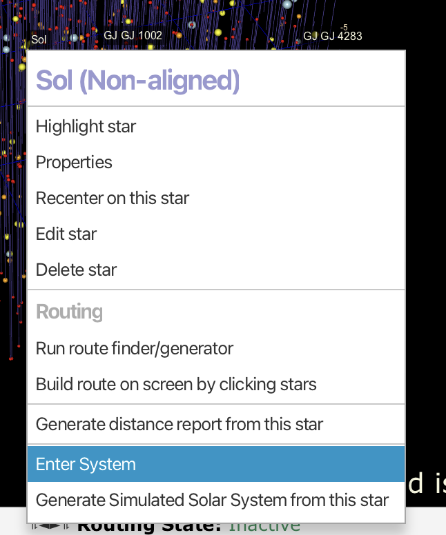
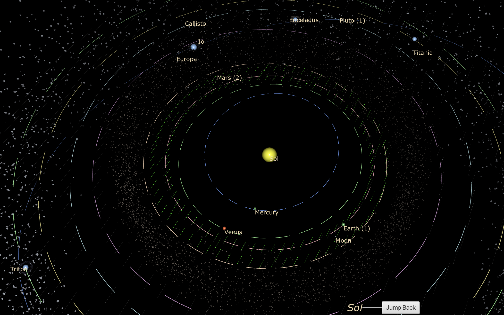
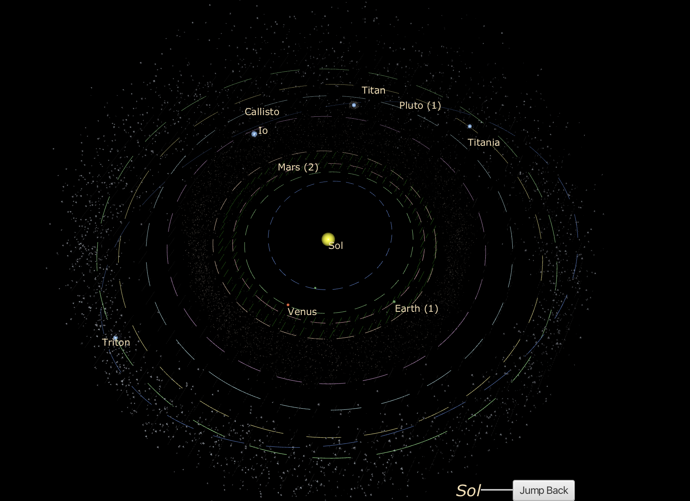
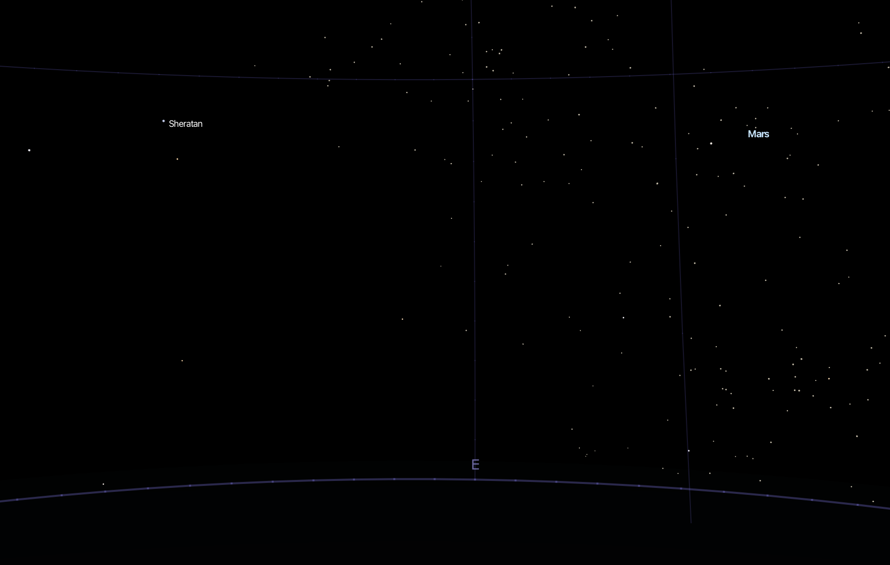
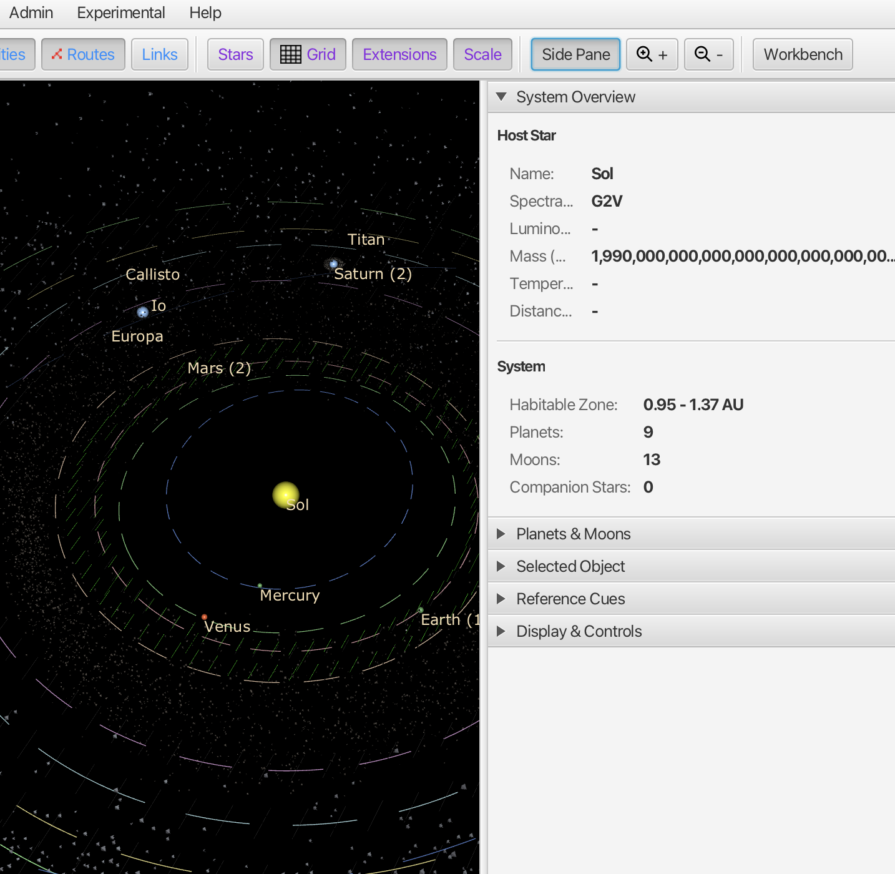
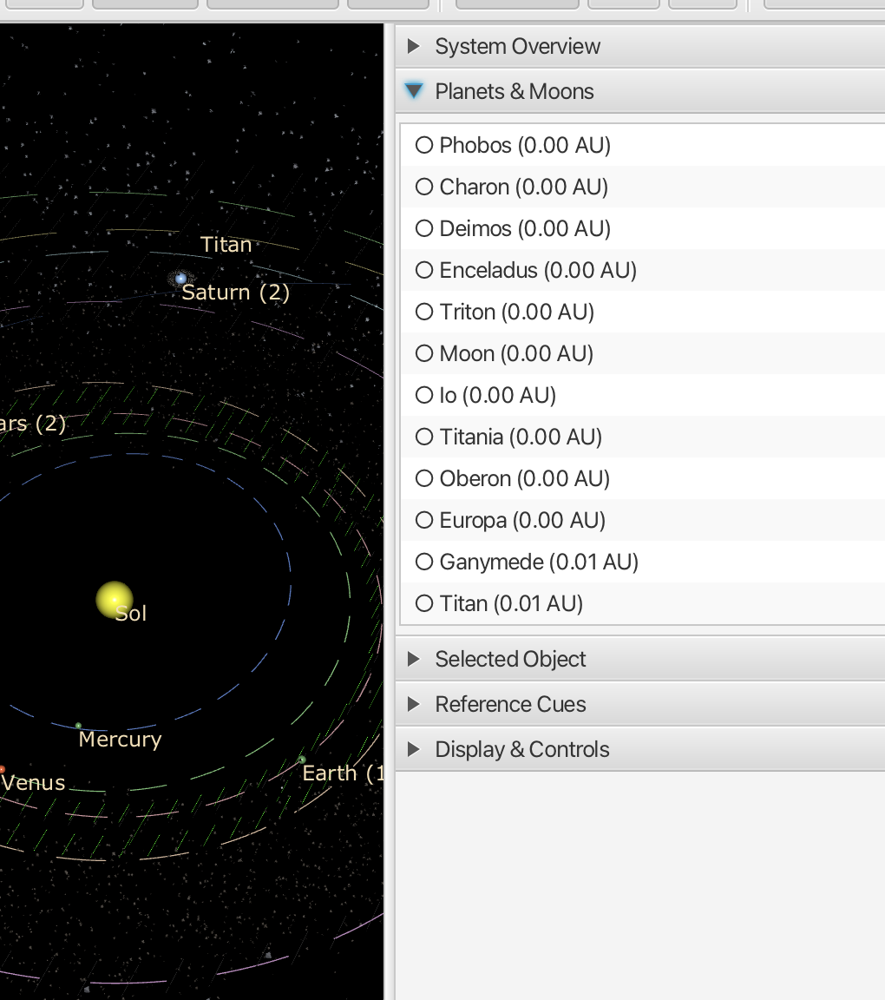
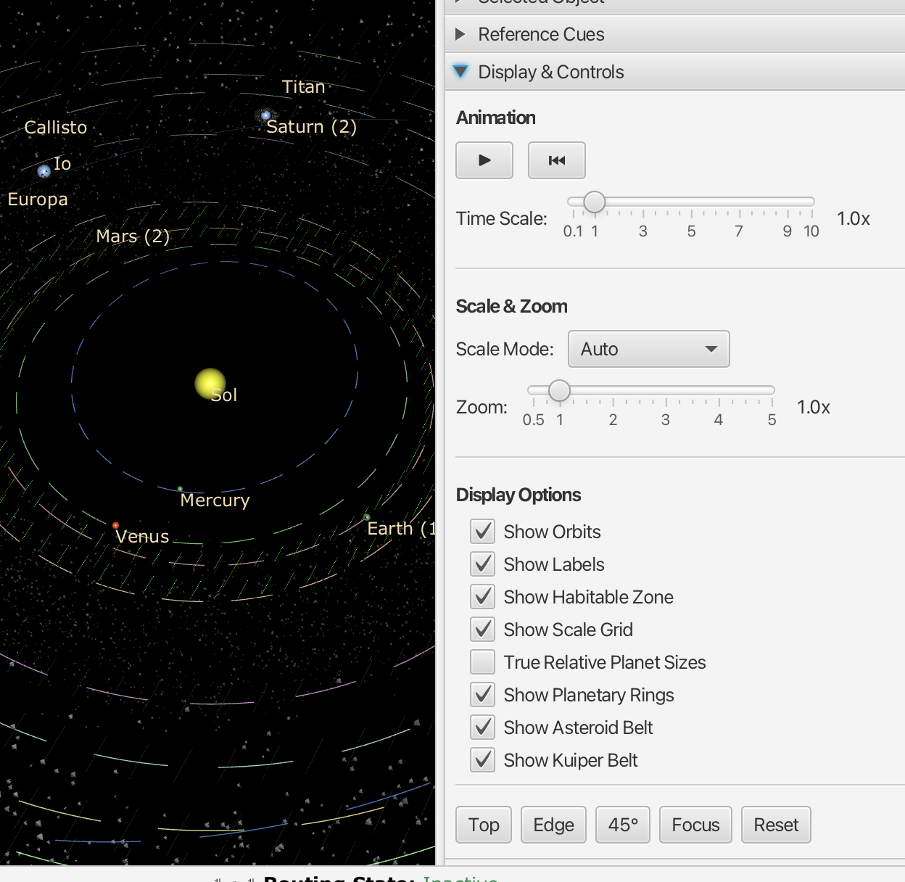
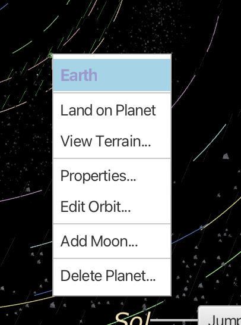

# Solar System View

The Solar System view lets you explore the planets, moons, and orbital structure around a selected star.

## Entering a Solar System

Right-click on any star in the Interstellar view to open the context menu:

The context menu shows the star name and polity affiliation at the top (e.g., "Sol (Non-aligned)").

Select **Enter System** to jump into the Solar System view:

## The Solar System Display

The Solar System view shows:

- **Central star**: The yellow sphere at the center (Sol in our solar system)
- **Planetary orbits**: Colored elliptical paths showing each planet's orbit
- **Planets and moons**: Labeled spheres positioned along their orbits
- **Habitable zone**: Dashed blue rings indicating the zone where liquid water could exist
- **Asteroid Belt**: A ring of debris between Mars and Jupiter (toggleable)
- **Kuiper Belt**: The outer debris field beyond Neptune (toggleable)
- **Background stars**: Distant stars visible in the background

### Orbit Colors

Orbits are color-coded:
- **Blue dashed rings**: Habitable zone boundaries
- **Green**: Inner planets and their orbits
- **Yellow/Gold**: Outer planet orbits
- **Purple/Pink**: Distant object orbits

### Labels

Planets show their name and moon count in parentheses:
- "Earth (1)" - Earth has 1 moon
- "Mars (2)" - Mars has 2 moons
- "Saturn (2)" - Saturn showing 2 major moons

Moons are labeled individually (Io, Europa, Callisto, Titan, etc.)

## Navigation

- **Drag**: Rotate the view around the star
- **Scroll**: Zoom in/out
- **Jump Back** button: Return to the Interstellar view

## Side Panel

Click **Side Pane** to view system details:

### System Overview

Shows information about the host star and system:

**Host Star:**
- Name (e.g., Sol)
- Spectral class (e.g., G2V)
- Luminosity, Mass, Temperature
- Distance from Sol

**System:**
- Habitable Zone range (e.g., 0.95 - 1.37 AU)
- Number of Planets (e.g., 9)
- Number of Moons (e.g., 13)
- Companion Stars count

### Planets & Moons

Lists all moons in the system with their distances from the host planet in AU (Astronomical Units). Click to select a moon or planet.

### Selected Object

When you select a planet or moon, shows detailed properties:

**Physical Properties:**
- Name
- Type
- Mass (Earth masses)
- Radius (Earth radii)
- Temperature (K)
- Gravity (log g)

**Orbital Properties:**
- Semi-major axis (AU)
- Eccentricity
- Inclination (degrees)
- Orbital Period (days)
- Argument of Periapsis (degrees)
- Longitude of Ascending Node (degrees)

### Reference Cues

Toggle display of reference markers and grids.

### Display & Controls

The Display & Controls panel provides animation and visualization options:

**Animation:**
- **Play/Pause**: Start or stop orbital animation
- **Reset**: Return to initial time position
- **Time Scale**: Speed of animation (0.1x to 10x)

**Scale & Zoom:**
- **Scale Mode**: Auto, Linear, or Logarithmic scaling
- **Zoom**: Adjust view magnification (0.5x to 5x)

**Display Options:**
| Option | Description |
|--------|-------------|
| **Show Orbits** | Display orbital paths |
| **Show Labels** | Display planet and moon names |
| **Show Habitable Zone** | Display the liquid water zone |
| **Show Scale Grid** | Display distance reference grid |
| **True Relative Planet Sizes** | Show planets at actual relative sizes |
| **Show Planetary Rings** | Display rings (Saturn, etc.) |
| **Show Asteroid Belt** | Display the main asteroid belt between Mars and Jupiter |
| **Show Kuiper Belt** | Display the outer Kuiper Belt beyond Neptune |

**View Presets:**
- **Top**: View from above the orbital plane
- **Edge**: View from the edge (side view)
- **45°**: Angled view
- **Focus**: Center on selected object
- **Reset**: Return to default view

## Planet Context Menu

Right-click on any planet or moon to access options:

| Option | Description |
|--------|-------------|
| **Land on Planet** | Enter the Night Sky view from this planet's surface |
| **View Terrain...** | Open the procedural terrain generator |
| **Properties...** | View detailed planet properties |
| **Edit Orbit...** | Modify orbital parameters |
| **Add Moon...** | Add a new moon to this planet |
| **Delete Planet...** | Remove this planet from the system |

## Generating Systems

For stars without defined planets, you can generate a simulated solar system:

1. Right-click the star in the Interstellar view
2. Select **Generate Simulated Solar System from this star**
3. A procedurally generated system will be created

## Related Topics

- [Interstellar View](interstellar-view.md)
- [Procedural Planets](procedural-planets.md)
- [Night Sky View](night-sky-view.md)
