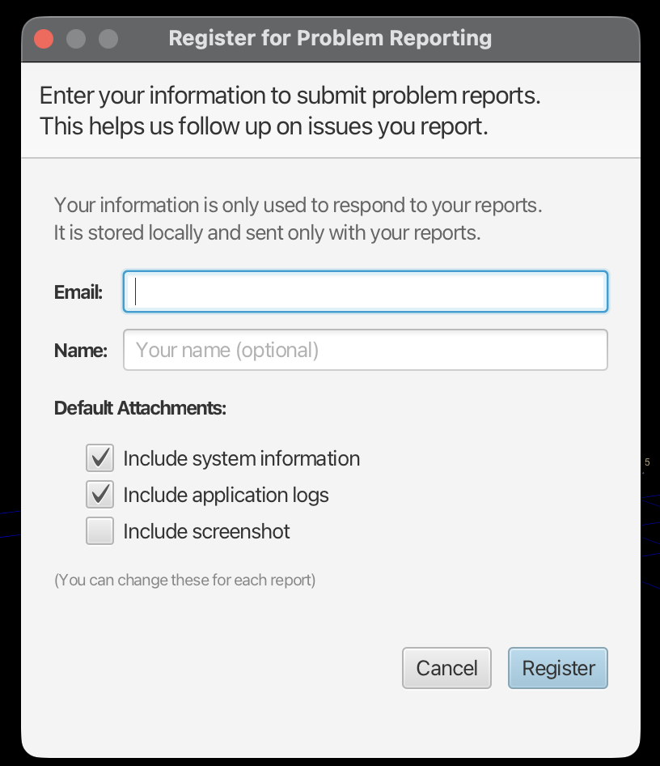

# Troubleshooting

## App Does Not Start

- Confirm you are using Java 25 or later
- If running a packaged build, ensure the installer completed successfully
- Check that JavaFX is properly installed
- Try running from the command line to see error messages:
  ```bash
  ./mvnw-java25.sh spring-boot:run
  ```

## Missing Data or Icons

- Verify `files/programdata/` exists and contains the CSV and PNG files
- Check file permissions for the `files/` directory
- If star shapes are missing, ensure `resources/objects/` contains the 3D mesh files

## Slow Startup

- Large databases can slow startup
- If the database is corrupt, delete the `data/` directory and re-import datasets
- Consider using smaller datasets for faster loading

## Display Issues

- If the 3D view is blank, ensure your graphics drivers are up to date
- JavaFX requires hardware acceleration on most platforms
- Try resizing the window or pressing **Escape** to reset the view

## Getting Help

The **Help** menu provides several support options:


| Option | Description |
|--------|-------------|
| **About TRIPS** | View version information and credits |
| **How to get support** | Information on getting help |
| **Check for update** | Check if a newer version is available |
| **Get Computer Description** | Show system information for troubleshooting |
| **Report a Problem...** | Submit a bug report |

## Reporting Problems

Select **Help > Report a Problem...** to submit a bug report:



### Setting Up Problem Reporting

The first time you report a problem, you'll be asked to register:

1. Enter your **Email** address (used to respond to your reports)
2. Enter your **Name** (optional)
3. Choose what to include by default:
   - **Include system information**: Hardware and software details
   - **Include application logs**: Recent log entries
   - **Include screenshot**: Current view (optional)

4. Click **Register** to save your preferences

These settings are stored locally and sent only with your reports.

### Submitting a Report

After registration, use **Help > Report a Problem...** to describe the issue. Include:
- What you were trying to do
- What happened instead
- Steps to reproduce the problem

The attached logs and system information help diagnose issues quickly.

## Database Issues

### Resetting the Database

If the database becomes corrupted:

1. Close TRIPS
2. Delete the `data/` directory (contains `tripsdb.*` files)
3. Restart TRIPS
4. Re-import your datasets via **File > Import > Load data set**

### Database Location

The H2 database is stored at `./data/tripsdb` (file-based). You can connect directly using:
- URL: `jdbc:h2:file:./data/tripsdb`
- Username: `sa`
- Password: (none)
